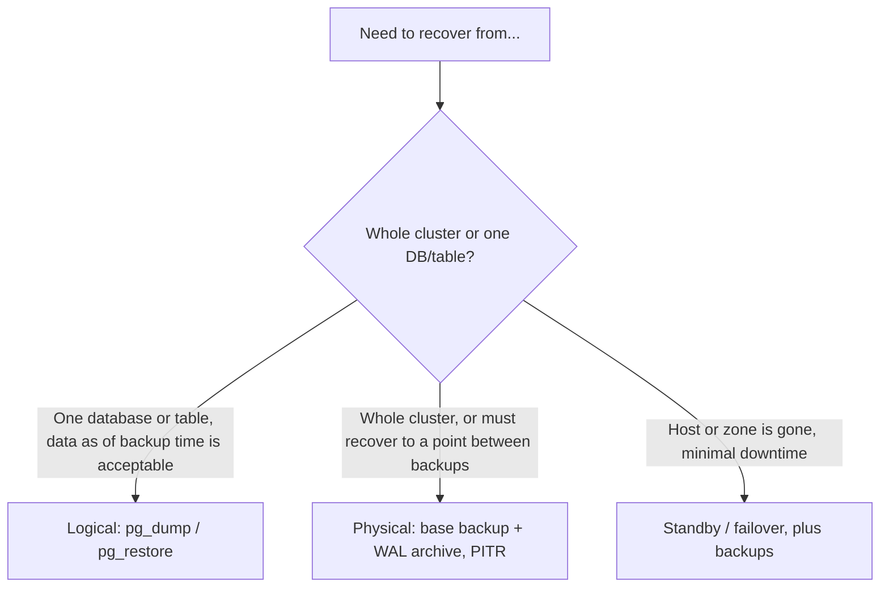

# Backups & Recovery

## What it is

How to take, store, verify, and restore PostgreSQL backups: logical dumps
(`pg_dump`), physical base backups plus WAL archiving (`pg_basebackup`,
point-in-time recovery), and the disaster-recovery planning around them.

## Why it matters

A backup that has never been restored is an assumption, not a backup.
Replication and RAID do not protect against `DROP TABLE`, a bad
migration, or corruption: they copy the mistake. Recovery time is set
by decisions made before the incident: what is backed up, where, how
often, and whether anyone has practiced restoring it.

## In this section

| Page | Covers |
|---|---|
| [backup-strategy.md](backup-strategy.md) | Logical vs. physical, RPO/RTO, 3-2-1 rule, retention, encryption, restore testing, tools |
| [pg-dump.md](pg-dump.md) | `pg_dump` formats, `-j`, compression, `pg_dumpall --globals-only`, flags |
| [pg-restore.md](pg-restore.md) | `pg_restore` and `psql` restores, `--clean --if-exists`, `-j`, `-1`, selective restore |
| [point-in-time-recovery.md](point-in-time-recovery.md) | `pg_basebackup`, WAL archiving, `recovery_target_time`, `recovery.signal`, step-by-step PITR |
| [disaster-recovery.md](disaster-recovery.md) | DR scenarios, standby vs. backup, failover, drill checklist |

Scripts: [scripts/backup/](../scripts/backup/README.md) and
[scripts/restore/](../scripts/restore/README.md).

## Quick decision guide

## Version notes

Examples target **PostgreSQL 16**. Version-dependent behavior is labeled
where it appears: `pg_dump -Z lz4|zstd` (16+), `pg_verifybackup` (13+),
`recovery.signal` replacing `recovery.conf` (12+), and
`recovery_target_timeline` defaulting to `latest` (12+).

## Where to go next

- Incident procedure when you are mid-outage:
  [15-production-runbooks/restore-database.md](../15-production-runbooks/restore-database.md)
- Command tables: [16-command-reference/pg-dump.md](../16-command-reference/pg-dump.md),
  [16-command-reference/pg-restore.md](../16-command-reference/pg-restore.md)
- Managed-service backups and snapshots:
  [13-cloud-production/managed-postgresql.md](../13-cloud-production/managed-postgresql.md)
- Credentials for backup jobs:
  [06-security/passwords-and-secrets.md](../06-security/passwords-and-secrets.md)
- Backup volumes in containers:
  [12-docker/persistent-volumes.md](../12-docker/persistent-volumes.md)
