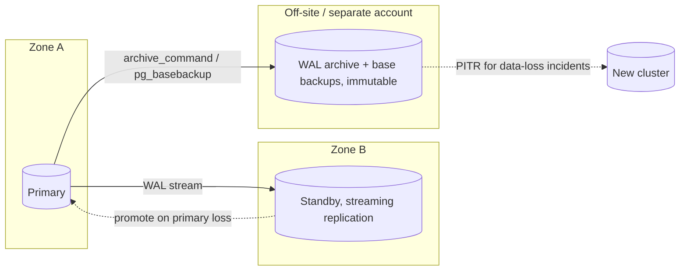

# Disaster Recovery

## What it is

The plan, infrastructure, and rehearsed procedure for restoring service
after losing a database host, an availability zone/region, an account, or
the data itself (deletion, corruption, ransomware).

## Why it matters

Failures differ, and each needs a different mechanism. A replica protects
against hardware loss but replicates `DROP TABLE` within seconds; a
backup protects against bad data but takes longer to bring back. DR
combines both and sets expectations (RPO/RTO, see
[backup-strategy.md](backup-strategy.md)).

## Failure scenarios and what covers them

| Scenario | Standby (streaming replica) | Base backup + WAL (PITR) | Logical dump |
|---|---|---|---|
| Host/disk failure | Yes (promote) | Yes (slower) | Yes (slowest) |
| Availability-zone loss | Yes, if standby is in another zone | Yes, if archive is off-host | Yes |
| Region loss | Only with cross-region replica | Only with cross-region copy | Only with cross-region copy |
| Accidental `DELETE`/`DROP` | **No** (replicated) | **Yes** (recover to before it) | Yes, as of dump time |
| Logical corruption / bad migration | **No** | **Yes** | Yes, as of dump time |
| Ransomware / account compromise | No | Only with immutable/off-account copy | Only with immutable/off-account copy |
| Major-version upgrade rollback | No | Same version only | Yes |

Replication is availability, not backup.

## Building blocks

- **Streaming standby**: continuously replays WAL from the primary.
  Create it with `pg_basebackup --write-recovery-conf` (`-R`), which
  writes `standby.signal` and `primary_conninfo` into the new data
  directory. Asynchronous replication can lose the last transactions on
  failover; synchronous replication (`synchronous_standby_names`) trades
  write latency and availability for zero loss. State this tradeoff
  against your RPO.
- **Failover**: promote the standby (`pg_ctl promote` Unix shell, or
  `SELECT pg_promote();` SQL). Fence the old primary first (stop it or
  cut it off) so two nodes never accept writes (split brain). Repoint
  clients via DNS, a virtual IP, or a pooler/proxy
  ([05-performance/connection-pooling.md](../05-performance/connection-pooling.md)).
  Failover automation (Patroni, repmgr, cloud-managed HA) is separate
  software; read its documentation for correct configuration.
- **Rejoin the old primary** as a standby only after it is rebuilt from a
  fresh base backup, or resynchronized with `pg_rewind` (requires
  `wal_log_hints` or data checksums enabled beforehand).
- **Backups off-host and off-account**, immutable if possible
  ([backup-strategy.md](backup-strategy.md)).
- **Configuration as code**: `postgresql.conf`, `pg_hba.conf`, roles,
  extensions, and infrastructure definitions in version control, so a new
  host can be built without guessing.

## Recovery procedure (data-loss incident)

1. **Stop the damage**: stop the offending job/deploy; revoke access if a
   credential is compromised. Preserve evidence (copy logs).
2. **Declare the target**: pick the recovery time just before the event
   (server logs, deploy time, application audit logs).
3. **Restore to a new host** via [PITR](point-in-time-recovery.md), or a
   dump via [pg-restore.md](pg-restore.md) if no WAL archive exists.
4. **Verify**: row counts, newest timestamps, application smoke tests.
5. **Cut over** (DNS/pooler), or extract just the lost rows from the
   recovered copy into production with SQL.
6. **Re-establish protection**: new base backup (new timeline after
   PITR), rebuild the standby, confirm archiving works.
7. **Write the postmortem**: cause, detection time, data lost vs. RPO,
   time taken vs. RTO.

Step-by-step incident version:
[15-production-runbooks/restore-database.md](../15-production-runbooks/restore-database.md).
If the database is simply down, start with
[15-production-runbooks/database-is-down.md](../15-production-runbooks/database-is-down.md).

## Drill checklist

Run at least on a schedule you commit to; record results.

- [ ] Latest base backup restores on a clean host with only documented steps
- [ ] PITR to a chosen timestamp succeeds; recovered data is as expected
- [ ] Restore time measured and compared to RTO
- [ ] Newest archived WAL is within the RPO (`pg_stat_archiver`)
- [ ] Roles, extensions, and config can be recreated
- [ ] Standby promotion tested; clients reconnect; old primary fenced
- [ ] Backup credentials, encryption keys, and runbooks are reachable when
      the primary environment is down
- [ ] Alerts exist for failed backups, archive failures, and replication lag
      ([14-observability/monitoring.md](../14-observability/monitoring.md))
- [ ] Someone other than the author can execute the runbook

## Common mistakes

- Treating a replica as a backup.
- Keeping backup credentials and encryption keys only inside the
  environment that failed.
- No fencing: two writable primaries after a partial failover.
- Promoting an out-of-date asynchronous standby without measuring the
  data loss.
- Never exercising failover; first attempt happens during the outage.
- Forgetting non-database state: secrets, object storage, queues,
  application config.

## Security considerations

- DR copies hold full data: apply the same encryption and access control
  as production, and keep delete rights separate (separate account/role).
- Restore drills use real data; run them in an access-controlled
  environment or with masked data.

## Provider-specific notes

Managed services provide automated backups, PITR windows, read replicas,
and multi-zone/multi-region failover under provider-specific names and
limits. Verify each against the provider's current documentation; see
[13-cloud-production/managed-postgresql.md](../13-cloud-production/managed-postgresql.md).

## Quick revision

- Replica = availability; backup/PITR = recovery from data loss. Need both.
- Define RPO/RTO; async replication can lose recent commits.
- Fence the old primary; avoid split brain.
- Keep one immutable, off-account copy.
- Drill: restore, PITR, failover; time it; fix what breaks.
