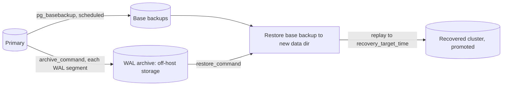

# Point-in-Time Recovery (PITR)

## What it is

PITR restores a **physical base backup** and then replays **archived WAL**
(write-ahead log) up to a chosen target: a timestamp, a named restore
point, a transaction ID, or an LSN. It recovers the **whole cluster** to
that moment, for example the second before a bad `DELETE` or `DROP TABLE`.

Components (PostgreSQL 16):

| Piece | Role |
|---|---|
| Base backup (`pg_basebackup`) | Consistent copy of the data directory |
| WAL archive (`archive_mode`, `archive_command`) | Continuous copy of each completed WAL segment |
| `restore_command` | Fetches archived segments during recovery |
| `recovery.signal` | Empty file in the data directory that starts targeted recovery |
| `recovery_target_*` | Where to stop |



## Why it matters

Nightly dumps lose up to a day of data. With continuous archiving, loss
is bounded by how fast WAL segments reach the archive (RPO of seconds to
minutes, tuned with `archive_timeout`). It is the only built-in way to
recover to "just before the mistake". See [backup-strategy.md](backup-strategy.md).

## Step 1: enable WAL archiving

`postgresql.conf` (PostgreSQL 16):

```ini
wal_level = replica          # default; must be replica or higher
archive_mode = on            # RESTART required to change
archive_command = 'test ! -f /mnt/wal_archive/%f && cp %p /mnt/wal_archive/%f'
archive_timeout = 300        # seconds; forces a segment switch so a quiet
                             # server still archives (illustrative value)
```

- `%p` is the path of the segment relative to the data directory; `%f`
  is its file name. The command must return exit code `0` **only** if
  the file is safely archived, and must not overwrite an existing file.
- The example `cp` to a local path is the docs' illustration. In
  production archive to storage off the database host, and `fsync` the
  copy; or use pgBackRest/Barman's archive commands (see
  [backup-strategy.md](backup-strategy.md)).
- `archive_mode` change needs a restart; `archive_command` changes need
  only a reload (`SELECT pg_reload_conf();`, SQL).
- If `archive_command` keeps failing, PostgreSQL retains unarchived
  segments in `pg_wal/` until the disk fills and the server stops.
  Monitor it (below).

Monitor archiving (SQL):

```sql
SELECT archived_count, last_archived_wal, last_archived_time,
       failed_count, last_failed_wal, last_failed_time
FROM pg_stat_archiver;
```

Alert when `last_failed_time` is newer than `last_archived_time`.

## Step 2: take base backups

```bash
# Unix shell. Run on the primary or a standby, as a role with REPLICATION
# (requires a pg_hba.conf "replication" entry for that role/host).
# -Fp plain copy; -X stream includes the WAL needed to make the backup
# consistent; -c fast forces an immediate checkpoint.
pg_basebackup --pgdata=/backups/base/2026-10-06 --format=plain \
  --wal-method=stream --checkpoint=fast --progress

# Verify against the backup manifest (PostgreSQL 13+; plain format)
pg_verifybackup /backups/base/2026-10-06
```

Expected: `backup successfully verified`. Use `--format=tar --gzip` to store
compressed tarballs (then extract before use; `pg_verifybackup` in 16
checks only plain-format backups). Encrypt and copy off-host afterwards.
`pg_basebackup` copies the entire cluster, so it needs roughly the
database's size in disk space and network bandwidth.

## Step 3: recover to a point in time

Perform this on a **new/empty data directory**, ideally on a separate
host first. Do not delete the failed cluster's data until the recovery is
confirmed.

1. Stop PostgreSQL on the target (`systemctl stop postgresql`, Unix shell).
2. Restore the base backup into the empty data directory; owner is the
   postgres OS user, mode `0700`.
3. Add to `postgresql.conf` (or `postgresql.auto.conf`):

```ini
restore_command = 'cp /mnt/wal_archive/%f %p'
recovery_target_time = '2026-10-06 18:08:06+00'   # include a time zone
recovery_target_action = 'promote'
```

4. Create the signal file, then start:

```bash
# Unix shell
touch /var/lib/postgresql/16/main/recovery.signal
systemctl start postgresql
```

5. Watch the log for `restored log file ... from archive` and
   `redo done` / `database system is ready`. With
   `recovery_target_action = 'promote'` the server leaves recovery by
   itself.
6. Verify the data (SQL): `SELECT pg_is_in_recovery();` must return `f`;
   query the affected tables.
7. Remove the temporary `restore_command`/`recovery_target_*` lines,
   point applications at the recovered server, and take a **new base
   backup** (the promotion started a new timeline).

Target options (set **one**):

| Parameter | Stops at |
|---|---|
| `recovery_target_time` | Timestamp (use an explicit time zone) |
| `recovery_target_xid` | A transaction ID |
| `recovery_target_lsn` | A WAL position |
| `recovery_target_name` | A name created earlier with `SELECT pg_create_restore_point('before_migration');` (SQL) |
| `recovery_target = 'immediate'` | Earliest consistent point (just the base backup) |

Related: `recovery_target_inclusive` (default `on`: stop just after the
target) and `recovery_target_action` (`pause` is the default and leaves
the server read-only for inspection; run `SELECT pg_wal_replay_resume();`
or promote with `pg_ctl promote` when satisfied).

Choose the target by finding the time of the mistake in the logs, then
step back. If you overshoot the damage, repeat recovery from the same
base backup with an earlier target; the archive is not consumed.

Version notes: PostgreSQL 12+ uses `recovery.signal` and ordinary
configuration parameters; the old `recovery.conf` file does not exist and
the server refuses to start if it is present. `recovery_target_timeline`
defaults to `latest` since 12.

## Verified example

The sequence above (WAL archive to a local directory, plain
`pg_basebackup -X stream`, insert, `drop table`, recover with
`recovery_target_time` set before the drop and `recovery_target_action =
'promote'`) was run against PostgreSQL 16.15 for this page; the dropped
table returned with the rows written before the target time.

## Destructive commands and precautions

| Command | Risk | Precaution |
|---|---|---|
| `pg_archivecleanup` / deleting archived WAL | Removing WAL needed by a retained base backup makes it unrecoverable past that point | Delete only segments older than the oldest base backup you keep; use the backup tool's retention |
| Replacing the data directory (`rm -rf` / overwrite) | Destroys the only copy if recovery then fails | Restore to a new directory or host; keep the old one until verified |
| `pg_resetwal` | Can corrupt data; last resort only | Never as part of PITR; consult the docs and take a copy of the directory first |

## Common mistakes

- Enabling `archive_mode` and never testing recovery.
- Archive on the same disk as `pg_data`; losing the host loses both.
- `archive_command` that overwrites, or returns `0` on failure.
- Not alerting on `pg_stat_archiver` failures; `pg_wal` fills the disk
  (see [15-production-runbooks/disk-full.md](../15-production-runbooks/disk-full.md)).
- Missing `recovery.signal`: the server starts normally and ignores
  `recovery_target_*`.
- Choosing a target earlier than the base backup's end: recovery cannot
  stop before the backup's consistency point. Use an older base backup.
- Restoring with a different PostgreSQL major version or architecture.
- Treating PITR as table-level recovery: it is cluster-level. To get one
  table, recover onto a scratch instance and copy the data out with
  `pg_dump`/SQL.

## Security considerations

- WAL contains all data changes in plaintext. Encrypt the archive and
  restrict access to it as strictly as to the database.
- The replication role used by `pg_basebackup` can read everything.
  Limit it in `pg_hba.conf` to the backup host with TLS
  (see [06-security/ssl.md](../06-security/ssl.md)).
- Archive credentials for object storage belong in a secrets manager.

## Performance considerations

- Archiving adds I/O per segment; `archive_command` latency does not
  block commits but backlog does consume `pg_wal` space.
- Recovery time is proportional to the WAL replayed since the base
  backup: more frequent base backups mean faster recovery.
- Managed services expose PITR as a feature with their own limits (see
  [13-cloud-production/managed-postgresql.md](../13-cloud-production/managed-postgresql.md)).

## Quick revision

- Base backup + continuous WAL archive = recover to any moment after the base backup.
- `archive_mode` needs restart; archive command must fail loudly and never overwrite.
- Recover: `restore_command` + `recovery_target_*` + `recovery.signal`, empty data dir.
- `promote` when done; take a new base backup after.
- Monitor `pg_stat_archiver`; test the recovery on a schedule.

See also: [disaster-recovery.md](disaster-recovery.md),
[pg-dump.md](pg-dump.md), [14-observability/monitoring.md](../14-observability/monitoring.md).
