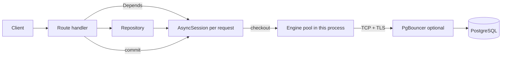

# Python, FastAPI and PostgreSQL

## What it is

Production patterns for a FastAPI service backed by PostgreSQL through
SQLAlchemy 2.x and the asyncpg driver: engine and pool configuration,
session lifecycle per request, transaction boundaries, repositories,
TLS, timeouts, and health endpoints.

## Why it matters

Most application-side database incidents come from a small set of
causes: a pool larger than the server can serve, a session shared
between requests, a transaction held open across slow work, N+1 queries,
or a connection string that silently fell back to plaintext. Each is a
configuration or structure decision made once, in code reviewed once.

## In this section

| Page | Covers |
|---|---|
| [sqlalchemy.md](sqlalchemy.md) | 2.x models, `select()`, sessions, transactions, N+1 and `selectinload`, parameterized queries |
| [async-postgresql.md](async-postgresql.md) | asyncpg, `AsyncSession`, sync vs async tradeoffs, lifespan, TLS, timeouts, health endpoint |
| [connection-pooling.md](connection-pooling.md) | `pool_size`, `max_overflow`, `pool_pre_ping`, `pool_recycle`, sizing, PgBouncer transaction mode |
| [repository-pattern.md](repository-pattern.md) | Where SQL lives, who commits, when the pattern is not worth it |
| [examples/](examples/README.md) | Index of the runnable projects |

Runnable code: [examples/fastapi-postgres/](../examples/fastapi-postgres/README.md)
and [examples/sqlalchemy-postgres/](../examples/sqlalchemy-postgres/README.md).

## Request lifecycle

One request gets one session; the handler (not the repository) commits;
leaving the request returns the connection to the pool.

## Version notes

Examples are tested with **Python 3.13, SQLAlchemy 2.1.3, asyncpg 0.31.0,
FastAPI 0.142.2, Pydantic 2.13.5, pydantic-settings 2.15.0** against
**PostgreSQL 16**. The `Mapped`/`mapped_column`, `select()`,
`AsyncSession`, and `async_sessionmaker` APIs used here are the 2.x
style (introduced in 1.4/2.0); do not mix in 1.x `Query` patterns.
Re-check the dialect notes in
[docs.sqlalchemy.org](https://docs.sqlalchemy.org/) after upgrading.

## Defaults used in this section

- App connects as `app_api`, a CRUD-only role; DDL runs as
  `migration_owner` ([06-security/least-privilege.md](../06-security/least-privilege.md)).
- Configuration only from environment variables; no credentials in code
  ([06-security/passwords-and-secrets.md](../06-security/passwords-and-secrets.md)).
- TLS with certificate verification
  ([06-security/ssl.md](../06-security/ssl.md);
  asyncpg specifics in [async-postgresql.md](async-postgresql.md#tls-with-asyncpg)).

## Where to go next

- Server-side pooling and `max_connections`:
  [05-performance/connection-pooling.md](../05-performance/connection-pooling.md)
- Reading query plans: [05-performance/explain.md](../05-performance/explain.md)
- Transactions and isolation: [04-transactions/transactions.md](../04-transactions/transactions.md)
- Schema migrations: [09-alembic/](../09-alembic/README.md)
- Health checks beyond the app: [14-observability/health-checks.md](../14-observability/health-checks.md)
- Container configuration: [12-docker/environment-variables.md](../12-docker/environment-variables.md)

## Quick revision

- One `AsyncSession` per request; never share one across concurrent tasks.
- Create the engine once, in `lifespan`; `dispose()` on shutdown.
- Pool size is per process: workers x (`pool_size` + `max_overflow`) must
  fit the server and the role's `CONNECTION LIMIT`.
- asyncpg TLS is `?ssl=...` or `connect_args={"ssl": ctx}`, not `sslmode`.
- Handler commits; repositories flush.
