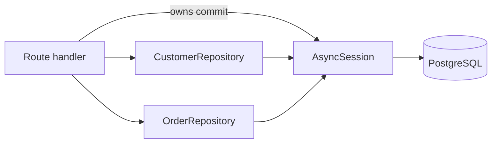

# Repository Pattern

Code: [examples/fastapi-postgres/app/repositories.py](../examples/fastapi-postgres/app/repositories.py)
and [examples/sqlalchemy-postgres/repository.py](../examples/sqlalchemy-postgres/repository.py).

## What it is

A repository is a small class that owns the SQL for one aggregate
(customers, orders). Handlers call methods like `add()` or
`list_after()` instead of building `select()` statements inline. The
repository receives a session and does not create or commit one.



## Why it matters

- Queries, loader options (`selectinload`), and keyset pagination live
  in one reviewable place, so N+1 and missing indexes are found there.
- The handler decides the transaction boundary, so two repository calls
  can commit or roll back together.
- Database errors (`IntegrityError` with a SQLSTATE) are translated into
  domain errors once, not in every handler.

## Rules

1. Repositories take an `AsyncSession` in `__init__`; they never create
   engines or sessions.
2. Repositories `flush()` (to obtain generated IDs and surface constraint
   errors) but never `commit()`. The handler or service commits once the
   whole unit of work succeeded.
3. Wrap expected constraint failures in `begin_nested()` so the session
   stays usable, and map SQLSTATE to a domain exception
   (`23505` unique violation, `23503` foreign-key violation).
4. Every method that returns relationships names its loader option; the
   models use `lazy="raise"` so a missing one fails in tests.
5. Return ORM objects or Pydantic models, never open cursors or result
   objects.
6. Parameterized statements only
   ([sqlalchemy.md](sqlalchemy.md#parameterized-queries-only)).

## Example

```python
class CustomerRepository:
    def __init__(self, session: AsyncSession) -> None:
        self._session = session

    async def add(self, email: str, name: str) -> Customer:
        customer = Customer(email=email, name=name)
        try:
            async with self._session.begin_nested():   # SAVEPOINT
                self._session.add(customer)
                await self._session.flush()
        except IntegrityError as exc:
            if getattr(exc.orig, "sqlstate", None) == "23505":
                raise DuplicateEmailError(email) from exc
            raise
        return customer
```

Handler (transaction boundary):

```python
@router.post("/customers", response_model=CustomerRead, status_code=201)
async def create_customer(body: CustomerCreate, session: SessionDep) -> CustomerRead:
    try:
        customer = await CustomerRepository(session).add(body.email, body.name)
    except DuplicateEmailError:
        raise HTTPException(409, "email already exists") from None
    await session.commit()
    return CustomerRead.model_validate(customer)
```

Two repositories in one transaction (for example creating an order and a
related audit row) share the same `session`, so one `commit()` makes both
durable or neither
([04-transactions/transactions.md](../04-transactions/transactions.md)).

## When to use it, and when not

| Situation | Guidance |
|---|---|
| Several handlers share the same queries | Repository removes duplication and gives one place to tune |
| Business rules span multiple aggregates | Add a service layer that coordinates repositories and commits |
| A tiny service with a few single-table endpoints | Inline `select()` in handlers is simpler; a repository adds indirection without reuse |
| Heavy reporting / analytic SQL | Keep as named query functions or views; forcing it behind generic CRUD methods obscures the SQL |
| Tests | Repositories make DB tests focused; testing handlers against a real PostgreSQL (as the example does) catches constraint, loader, and transaction bugs that mocks hide |

Avoid a "generic repository" (`get`, `list`, `filter(**kwargs)` for every
model): it hides the query shape, invites unindexed filters, and makes N+1
easy to reintroduce. Write the methods each use case needs.

## Common mistakes

- Committing inside the repository, making multi-step units of work
  non-atomic.
- A repository holding its own long-lived session.
- Mocking the session in tests, so constraint violations, `lazy="raise"`,
  and SQLSTATE mapping are never exercised.
- Returning lazily-loaded relationships to the handler.
- Matching on exception message text instead of `sqlstate`.

## Security considerations

Repositories are the choke point for the "validated input only" rule:
accept typed, already-validated arguments (Pydantic models) and bind
them as parameters. For agent or LLM-driven callers, never expose a
method that executes caller-supplied SQL
([11-agentic-ai/tool-calls.md](../11-agentic-ai/tool-calls.md)).

## Quick revision

- Repository = SQL for one aggregate; takes a session; flushes, never commits.
- Handler/service owns the transaction and commits once.
- Savepoint + SQLSTATE mapping for expected constraint failures.
- Skip the pattern for trivial services; skip generic repositories always.
