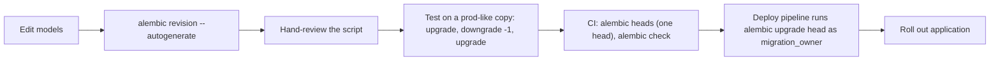

# Alembic Overview

Alembic is the schema-migration tool for SQLAlchemy. It records schema
changes as ordered Python scripts and tracks the applied revision in an
`alembic_version` table. Versions used on these pages: **Alembic 1.16**,
**SQLAlchemy 2.0**, **PostgreSQL 16**, asyncpg 0.30. Runnable project:
[examples/alembic-postgres/](../examples/alembic-postgres/README.md).

## Pages

| Page | Use it when |
|---|---|
| [commands.md](commands.md) | You need the exact `alembic` command or flag |
| [migrations.md](migrations.md) | Writing migrations: `env.py`, autogenerate and its limits, concurrent indexes, data migrations |
| [production-migrations.md](production-migrations.md) | Changing a live table: lock levels, expand/contract, backfills, deploy ordering |
| [rollback-strategies.md](rollback-strategies.md) | A migration failed or must be undone: downgrade vs roll-forward |

## Workflow

## Rules of this repo (from [AGENTS.md](../AGENTS.md#10-migration-rules))

- Treat every production migration as high-risk: state lock behavior,
  backward compatibility with the running app version, and the rollback
  plan before merging.
- Run migrations as the DDL role (`migration_owner`), never as the
  application role (`app_api`). See
  [06-security/least-privilege.md](../06-security/least-privilege.md).
- Do not edit a migration that has been applied in a shared environment;
  add a new one. See
  [rollback-strategies.md](rollback-strategies.md#editing-an-applied-migration).
- Drops and in-place renames are never the first option: use
  expand/contract.

## Related

- [04-transactions/locking.md](../04-transactions/locking.md): lock modes
- [03-database-design/foreign-keys.md](../03-database-design/foreign-keys.md), [03-database-design/indexes.md](../03-database-design/indexes.md)
- [08-python-fastapi/sqlalchemy.md](../08-python-fastapi/sqlalchemy.md): the models Alembic compares against
- [15-production-runbooks/failed-migration.md](../15-production-runbooks/failed-migration.md), [15-production-runbooks/lock-contention.md](../15-production-runbooks/lock-contention.md)
