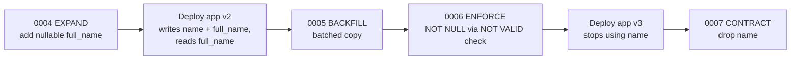

# Production Migrations

PostgreSQL 16, Alembic 1.16. Lock behavior below was **observed on
PostgreSQL 16.x** using `pg_locks` and `relfilenode` in a test database;
the migrations are in
[examples/alembic-postgres/](../examples/alembic-postgres/README.md).
Lock modes are described in
[04-transactions/locking.md](../04-transactions/locking.md).

## What it is

Changing the schema of a database that is serving traffic, without
downtime and without breaking either the old or the new application
version.

## Why it matters

Most `ALTER TABLE` forms take `ACCESS EXCLUSIVE`, which blocks every
read and write on the table. The statement is usually instant, but it
must first **acquire** the lock, and while it waits it blocks everything
behind it. The risk is the wait and the rewrite/scan, not the DDL itself.

## Pre-merge checklist (per AGENTS.md section 10)

1. **Backward compatibility:** can the old app and the new app both run
   against the schema as it is mid-migration?
2. **Locks:** which lock does each statement take, and for how long
   (table below)?
3. **Table size:** does it rewrite or scan the table? Is a batched or
   concurrent form available?
4. **Ordering:** migrate-then-deploy or deploy-then-migrate?
5. **Rollback:** downgrade, roll-forward, or irreversible? See
   [rollback-strategies.md](rollback-strategies.md).
6. **Tested** on a production-sized copy: `upgrade`, `downgrade -1`,
   `upgrade`, and timing recorded.
7. Backup/snapshot taken before any destructive step
   ([07-backups-recovery/backup-strategy.md](../07-backups-recovery/backup-strategy.md)).

## Lock levels of common operations (PostgreSQL 16)

"Observed" = checked in `pg_locks` while the statement ran in an open
transaction. Others follow the PostgreSQL documentation
([ALTER TABLE](https://www.postgresql.org/docs/16/sql-altertable.html),
[explicit locking](https://www.postgresql.org/docs/16/explicit-locking.html)).

| Operation | Lock on the table | Rewrites/scans? | Safe form |
|---|---|---|---|
| `ADD COLUMN` (nullable, no default) | `ACCESS EXCLUSIVE` (observed), brief | No | Plain, with `lock_timeout` |
| `ADD COLUMN ... DEFAULT <constant>` | `ACCESS EXCLUSIVE`, brief | **No** since PG 11 (observed: `relfilenode` unchanged) | Plain, with `lock_timeout` |
| `ADD COLUMN ... DEFAULT random()` (volatile) | `ACCESS EXCLUSIVE` | **Full rewrite** (observed: `relfilenode` changed) | Add nullable, backfill in batches, then default for new rows |
| `ALTER COLUMN SET NOT NULL` | `ACCESS EXCLUSIVE` (observed) | Scans, **unless** a validated `CHECK (col IS NOT NULL)` exists (PG 12+; observed `existing constraints ... are sufficient`) | `CHECK ... NOT VALID` -> `VALIDATE` -> `SET NOT NULL` -> drop check |
| `ALTER COLUMN TYPE` | `ACCESS EXCLUSIVE` (observed) | Usually a full rewrite; some binary-coercible changes skip it | Expand/contract with a new column |
| `ADD CONSTRAINT ... CHECK` | `ACCESS EXCLUSIVE`, full scan | Yes | `... NOT VALID`: brief lock (observed `ACCESS EXCLUSIVE`), no scan |
| `VALIDATE CONSTRAINT` | `SHARE UPDATE EXCLUSIVE` (observed) | Scan, reads and writes continue | |
| `ADD FOREIGN KEY` | `SHARE ROW EXCLUSIVE` on both tables | Scan | `... NOT VALID` (no scan, same lock level, observed) then `VALIDATE CONSTRAINT` |
| `CREATE INDEX` | `SHARE` (observed): blocks writes | Reads the table | `CREATE INDEX CONCURRENTLY` |
| `CREATE INDEX CONCURRENTLY` | `SHARE UPDATE EXCLUSIVE`: writes continue | Two scans, slower | Needs `autocommit_block()`; leaves `INVALID` index on failure |
| `DROP COLUMN` | `ACCESS EXCLUSIVE` (observed) | No (marked dropped; space reclaimed lazily) | Only in the contract phase |
| `RENAME COLUMN` / `RENAME TO` | `ACCESS EXCLUSIVE` | No | Breaks old app instances instantly: use expand/contract |
| `DROP TABLE` | `ACCESS EXCLUSIVE` | | Contract phase only |

See also [03-database-design/foreign-keys.md](../03-database-design/foreign-keys.md)
and [03-database-design/constraints.md](../03-database-design/constraints.md).

## Lock queueing and `lock_timeout`

`ALTER TABLE` needs `ACCESS EXCLUSIVE`, which conflicts with everything.
If any transaction (even one idle `SELECT` inside a long
`BEGIN`) holds a lock on the table, the DDL waits, and **every later
query on that table queues behind the waiting DDL**.

Observed on PostgreSQL 16: with a session holding an open transaction that
had read `app.users`, an `ALTER TABLE app.users ...` showed
`wait_event_type = Lock`, and a separate `SELECT count(*) FROM app.users`
did not return (it hit its own 3 s `statement_timeout`). With
`MIGRATION_LOCK_TIMEOUT_MS=1000` the migration instead failed after about
1 s with `canceling statement due to lock timeout`, and `alembic current`
still reported the previous revision (the failed run rolled back).

Fix: set a short `lock_timeout` for the migration session
([env.py](../examples/alembic-postgres/alembic/env.py)) and **retry** on
failure, ideally off-peak:

```sql
-- PostgreSQL SQL: per-session or per-transaction equivalent
SET lock_timeout = '5s';
SET LOCAL lock_timeout = '5s';   -- inside a transaction only
```

Tradeoff: a short timeout makes the migration fail under load instead of
stalling the app; a long one risks an app-wide stall. The value is
workload-specific (the example's 5 s is illustrative). Find the blocker
with [14-observability/pg-locks.md](../14-observability/pg-locks.md) and
[15-production-runbooks/lock-contention.md](../15-production-runbooks/lock-contention.md).

## Expand/contract: rename a column

Goal: rename `users.name` to `users.full_name` without downtime. Implemented
as revisions `0004`-`0007` in the example.



| Step | App compat | Rollback |
|---|---|---|
| 0004 add nullable column | v1 ignores it | `downgrade -1` (drops an empty column) |
| app v2 dual-writes | v1 and v2 coexist | Redeploy v1 |
| 0005 backfill | Idempotent; only rows with `full_name IS NULL` | Re-run; nothing to undo |
| 0006 enforce | Requires v2 everywhere (v1 would leave `full_name` NULL and fail) | `downgrade -1` drops `NOT NULL` |
| app v3 | No access to `name` | Redeploy v2 |
| 0007 drop `name` | Irreversible without backup (see warning) | Roll forward / restore |

**Destructive: `DROP COLUMN`.** It permanently removes the data. Before
running: confirm no running release reads or writes the column, take a
verified backup/snapshot, confirm the target with `alembic current`. Safer
alternative: leave the column unused for a release cycle first. Never
`ALTER TABLE ... RENAME COLUMN` on a live table as the first option.

## Batched backfill

One `UPDATE` over a large table holds row locks until commit, creates a
dead tuple per row (bloat, see [05-performance/vacuum.md](../05-performance/vacuum.md)),
and produces a WAL burst that lags replicas. Commit per batch instead.
From
[0005](../examples/alembic-postgres/alembic/versions/0005_backfill_users_full_name.py),
**Python** + **PostgreSQL SQL**:

```python
BACKFILL_BATCH = sa.text("""
    UPDATE app.users SET full_name = name
     WHERE id IN (SELECT id FROM app.users
                   WHERE full_name IS NULL
                   ORDER BY id LIMIT :batch_size
                   FOR UPDATE SKIP LOCKED)
""")

def upgrade() -> None:
    bind = op.get_bind()
    with op.get_context().autocommit_block():      # each statement commits itself
        while True:
            if bind.execute(BACKFILL_BATCH, {"batch_size": 1000}).rowcount == 0:
                break
```

Verified: with 2,500 rows and a batch size of 1,000 the loop converged
to zero NULL rows. For very large tables run the loop as a separate job or
script (with a pause between batches and replication-lag checks) rather
than inside the deploy, and keep batch size a tuned value, not a rule.
An index on the predicate column may be needed if `full_name IS NULL`
scans become the bottleneck: justify it by that query and drop it after.

## NOT NULL and constraints on a large table

```sql
-- PostgreSQL SQL (PG 12+)
ALTER TABLE app.users ADD CONSTRAINT ck_users_full_name_not_null
    CHECK (full_name IS NOT NULL) NOT VALID;     -- brief lock, no scan
ALTER TABLE app.users VALIDATE CONSTRAINT ck_users_full_name_not_null;  -- SHARE UPDATE EXCLUSIVE
ALTER TABLE app.users ALTER COLUMN full_name SET NOT NULL;   -- no scan: proven by the check
ALTER TABLE app.users DROP CONSTRAINT ck_users_full_name_not_null;
```

Same pattern for foreign keys: `ADD CONSTRAINT ... FOREIGN KEY ... NOT VALID`,
then `VALIDATE CONSTRAINT`. In Alembic use `op.execute(...)` for the
`NOT VALID`/`VALIDATE` statements (revision
[0006](../examples/alembic-postgres/alembic/versions/0006_enforce_users_full_name_not_null.py)).

## Deployment ordering

| Order | Works when | Breaks when |
|---|---|---|
| **Migrate, then deploy** | Migration is additive (expand): old app ignores new columns/tables | Migration removes or renames anything the running app uses |
| **Deploy, then migrate** | Contract phase: new app no longer uses the object being removed | New app needs a column that does not exist yet |

Tradeoff, not a single answer: expand steps go first, contract steps go
last; each release pairs with the migration that is safe for **both**
neighbouring app versions. Rule of thumb for review: every revision must
be safe with app version N and N+1 running at once.

Run `alembic upgrade head` **once** from the deploy pipeline as
`migration_owner`, before rolling out the new application (for expand
steps). Do not run it from every app instance on start. Keep the
migration credential out of the application's environment
([least-privilege.md](../06-security/least-privilege.md#production-usage)).
Note: with `ALTER DEFAULT PRIVILEGES FOR ROLE migration_owner`, the
`alembic_version` table in the app schema is also granted to `app_rw`
(observed); revoke that if the app should not see it.

## Reviewing the SQL

```bash
alembic upgrade 0004:head --sql > plan.sql   # Unix shell
```

Offline output shows the DDL and the transaction boundaries
(`autocommit_block()` renders as `COMMIT; ...; BEGIN;`). Python-driven
data steps are not rendered; see [commands.md](commands.md#command-specific-cautions).

## Security considerations

- Separate roles: `migration_owner` (DDL), `app_api` (CRUD), admin for
  humans. Migration credential only in the pipeline.
- No secrets in `alembic.ini`, migration files, or CI logs; `.env.example`
  with placeholders only.
- Data migrations that handle personal data: do not log row contents.

## Performance considerations

- Index builds: `CONCURRENTLY` trades a longer build and two table scans
  for not blocking writes; it competes for I/O with production traffic.
- Backfills: bounded batches, throttle, watch replication lag and
  autovacuum.
- Every added index slows every write on that table.

## Common mistakes

- Running `ALTER TABLE` with no `lock_timeout` during peak traffic.
- `ADD COLUMN ... DEFAULT <volatile expression>` on a big table (rewrite).
- `CREATE INDEX` without `CONCURRENTLY` on a live table.
- Renaming or dropping in the same release that stops using the object.
- `SET NOT NULL` directly on a big table.
- One long migration transaction that holds early locks until the end.
- Applying an enforcing migration (0006) before every writer sets the new column.

## AI/agentic use case

Agent state tables (`agent_runs`, `tool_calls`, see
[11-agentic-ai/production-agent-schema.md](../11-agentic-ai/production-agent-schema.md))
are written continuously by workers. Add columns nullable first, deploy
workers that write them, then enforce; long-running agent runs mean old
and new worker versions overlap for hours, so contract steps wait for
runs started by the old version to drain. Never let an agent or LLM
generate or apply migrations unreviewed.

## Troubleshooting

| Symptom | Next step |
|---|---|
| Whole app stalls during migration | A DDL is queued for a lock: [lock-contention runbook](../15-production-runbooks/lock-contention.md); cancel the migration session (see rollback page) |
| `lock timeout` error | Expected guard rail: find blocker, retry |
| Index shows `INVALID` | `DROP INDEX CONCURRENTLY`, re-run |
| `VALIDATE CONSTRAINT` fails | Rows violate it: fix data, re-run |
| Migration failed mid-way | [15-production-runbooks/failed-migration.md](../15-production-runbooks/failed-migration.md) |

## Quick revision

- Additive first, destructive last; every revision safe for N and N+1.
- `lock_timeout` + retry; never wait unbounded for `ACCESS EXCLUSIVE`.
- `NOT VALID` then `VALIDATE`; `CONCURRENTLY` in its own revision.
- Batched, idempotent backfills outside one big transaction.
- Backup before any drop.
