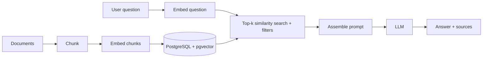

# RAG with pgvector

The runnable implementation is in
[examples/pgvector-rag/](../examples/pgvector-rag/README.md). This page
explains the design decisions; the example runs without an API key by using a
clearly labeled **stub** embedder.

## What it is

Retrieval-Augmented Generation: retrieve the stored text chunks most relevant
to a question, put them into the LLM prompt, and have the model answer from
that context. PostgreSQL + pgvector is the retrieval store.



## Why it matters

The database is the part that makes RAG repeatable: idempotent ingestion,
metadata filters, access control, and re-embedding when the model changes.
Most RAG quality problems come from chunking, the embedding model, and
filtering, not from the choice of HNSW vs. IVFFlat
([indexing.md](indexing.md)).

## Schema

Excerpt from [schema.sql](../examples/pgvector-rag/schema.sql) (PostgreSQL 16,
pgvector 0.8.1 validated):

```sql
CREATE TABLE documents (
    id         BIGINT GENERATED ALWAYS AS IDENTITY PRIMARY KEY,
    source     TEXT NOT NULL UNIQUE,          -- idempotent re-ingest key
    title      TEXT NOT NULL,
    category   TEXT NOT NULL,
    created_at TIMESTAMPTZ NOT NULL DEFAULT now()
);

CREATE TABLE chunks (
    id          BIGINT GENERATED ALWAYS AS IDENTITY PRIMARY KEY,
    document_id BIGINT NOT NULL REFERENCES documents (id) ON DELETE CASCADE ON UPDATE CASCADE,
    chunk_index INTEGER NOT NULL CHECK (chunk_index >= 0),
    content     TEXT NOT NULL,
    category    TEXT NOT NULL,
    embedding   vector(384) NOT NULL,         -- must match the model output size
    embedder    TEXT NOT NULL,                -- model/stub that produced the vector
    created_at  TIMESTAMPTZ NOT NULL DEFAULT now(),
    UNIQUE (document_id, chunk_index)
);

CREATE INDEX chunks_embedding_hnsw ON chunks
    USING hnsw (embedding vector_cosine_ops) WITH (m = 16, ef_construction = 64);
```

Design choices:

- **Dimension 384** is the example's choice for the stub. A real model has its
  own fixed dimension; change the column, `EMBEDDING_DIM`, and re-embed
  everything together ([embeddings.md](embeddings.md)).
- **Cosine distance** (`<=>`, `vector_cosine_ops`): insensitive to vector
  length, so it works whether or not a model normalizes. Use the metric your
  real model is designed for.
- **HNSW**: no training step, so the index can exist before data. Tradeoff
  vs. IVFFlat in [indexing.md](indexing.md).
- **`embedder` column** records which model produced each row, making a model
  migration detectable.
- **`category` denormalized onto chunks** so metadata filtering needs no join in
  the filtered scan. Tradeoff: must be kept in sync with `documents`.

## Ingestion

1. Split text into chunks (size/overlap are tuning parameters, not constants).
2. Embed chunks in a batch **before** opening the DB transaction.
3. In one transaction: upsert the document, delete its old chunks, insert the
   new chunks and vectors. Re-running ingestion for the same `source` replaces
   it instead of duplicating (validated: ingesting twice leaves 4 chunks for 4
   sources).
4. For large loads, use `COPY` and create the index afterward.

Chunking guidance: prefer boundaries meaningful to the content (headings,
paragraphs) over fixed windows; keep chunks self-contained; size them to the
embedding model's input limit. The example uses fixed character windows for
simplicity; that is a demo choice and a known quality limitation.

## Retrieval

```sql
SELECT c.content, d.source, c.chunk_index, c.embedding <=> $1 AS distance
FROM chunks c JOIN documents d ON d.id = c.document_id
WHERE c.category = $2            -- optional metadata filter, bound parameter
ORDER BY c.embedding <=> $1
LIMIT 4;
```

Filter behavior with approximate indexes (post-filtering, iterative scans,
partial indexes, partitions) is covered in
[similarity-search.md](similarity-search.md#metadata-filtering). Multi-tenant
corpora: enforce tenant isolation in the schema (partitions or row-level
security, see [06-security/permissions.md](../06-security/permissions.md)),
not only in prompt text.

## Prompt assembly

Put the retrieved chunks in a clearly delimited context block with source
identifiers so the answer can cite them. Treat retrieved text as **untrusted
data**: documents can contain instructions ("ignore previous...") that attempt
prompt injection. Instruct the model to treat context as data, and never let
model output flow into SQL or privileged tool calls without validation
(AGENTS.md section 12). The example's `build_prompt` shows the shape; it does
not call an LLM.

## Evaluation

Measure two things separately:

1. **Retrieval**: for a labeled set of questions, is the right chunk in the top-k? Also measure ANN recall against exact search ([similarity-search.md](similarity-search.md#measuring-recall)).
2. **Generation**: given the retrieved context, is the answer grounded and correct?

Do not tune an index to fix a chunking or embedding problem; fix upstream
first. Any similarity cutoff must come from your evaluation data, not a
universal constant.

## Production usage

- Separate roles: migration role creates the extension/tables; the application
  role gets only `SELECT`/`INSERT`/`UPDATE`/`DELETE` on the tables it needs
  ([06-security/least-privilege.md](../06-security/least-privilege.md)).
- API keys for a real embedding/LLM provider come from environment variables or a secrets manager.
- Embedding calls are network calls with failures and rate limits: batch them, retry with backoff, and make the job idempotent.
- Version the pipeline: store `embedder` and, if useful, a chunking version.
- For agent memory and conversation history in the same database, see
  [11-agentic-ai/conversation-memory.md](../11-agentic-ai/conversation-memory.md).
- Connection pooling for the API tier: [05-performance/connection-pooling.md](../05-performance/connection-pooling.md).

## Common mistakes

- Treating the stub's results as evidence of real retrieval quality.
- Embedding queries and documents with different models.
- Re-ingesting without deleting old chunks, creating duplicates.
- Putting user-controlled filter values into SQL strings.
- Building a vector index before knowing exact search is too slow.

## Quick revision

- Chunk, embed (outside the transaction), store text + vector together, idempotently.
- Same model for queries and documents; dimension in the schema equals the model's.
- Cosine + HNSW is one reasonable default, not a universal answer; measure recall and answer quality.
- Retrieved text is untrusted input.
