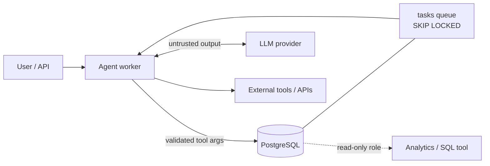

# Agentic AI on PostgreSQL

## What it is

PostgreSQL as the durable system of record for AI agents and LLM
applications: conversations, runs, tool calls, workflow checkpoints, task
queues, audit trail, and token/cost accounting. Stack covered here assumes
PostgreSQL 16, Python 3.11+, psycopg 3 / SQLAlchemy 2.x.

## Why it matters

An agent process is a crash-prone, retrying, concurrent client of your
database. The model call is non-deterministic, slow, and its output is
untrusted. The database is the one place that can guarantee:

| Concern | Database mechanism | Page |
|---|---|---|
| Idempotency (retried step must not double-apply) | `UNIQUE (run_id, idempotency_key)` + `ON CONFLICT` | [tool-calls.md](tool-calls.md) |
| Resumability | Checkpoint row per run, `step` + `state` | [workflow-state.md](workflow-state.md) |
| Concurrency (two workers, one run) | `FOR UPDATE SKIP LOCKED`, version column, advisory locks | [agent-state.md](agent-state.md) |
| Auditability | Append-only `audit_logs`, `REVOKE UPDATE, DELETE` | [audit-logs.md](audit-logs.md) |
| Transactional consistency | Agent state and business data in one transaction | [agent-state.md](agent-state.md#transactional-consistency-with-business-data) |
| Untrusted LLM output | Validation before write, least-privilege roles, CHECKs | [tool-calls.md](tool-calls.md#never-trust-llm-output) |
| Memory / RAG | `messages` + pgvector | [conversation-memory.md](conversation-memory.md) |

## Pages

| Page | Covers |
|---|---|
| [production-agent-schema.md](production-agent-schema.md) | Full schema, ER diagram, indexes, roles |
| [agent-state.md](agent-state.md) | Run lifecycle, state machines, locking, optimistic concurrency |
| [workflow-state.md](workflow-state.md) | Checkpoints, resume, task queue, retries, leases |
| [tool-calls.md](tool-calls.md) | Idempotency keys, JSONB args/results, validation, prompt injection |
| [conversation-memory.md](conversation-memory.md) | Messages, ordering, retention, partitioning, vector memory |
| [audit-logs.md](audit-logs.md) | Append-only log, triggers, usage/cost ledger |

Runnable code: [examples/production-agent-db](../examples/production-agent-db/README.md)
(DDL files plus four Python demos, no LLM API key required).

## Architecture

Rules this module applies throughout:

1. The model proposes; the application validates; the database enforces.
2. One transaction covers agent state and the business rows it changes.
3. Every state change is retry-safe and attributable.
4. The runtime role cannot rewrite history (audit) or change schema.

## Tradeoffs to decide up front

- **PostgreSQL as queue vs. a broker** (SQS, RabbitMQ, Redis): a `tasks`
  table gives transactional enqueue with business writes and simple ops, at
  the cost of polling, dead-tuple churn (see [05-performance/vacuum.md](../05-performance/vacuum.md)),
  and a throughput ceiling well below a dedicated broker. Prefer a broker
  when you need very high fan-out or cross-service delivery semantics.
- **Rows vs. JSONB**: relational columns for anything you filter, join, or
  constrain; JSONB for payloads whose shape varies per tool.
- **pgvector vs. dedicated vector DB**: see [10-pgvector/README.md](../10-pgvector/README.md).
- **Persist everything vs. retention**: full transcripts are valuable for
  debugging and evals, and are also PII and storage cost. Decide retention
  per table ([conversation-memory.md](conversation-memory.md#retention-and-partitioning)).

## Quick revision

- `UNIQUE (run_id, idempotency_key)` makes retries safe.
- `FOR UPDATE SKIP LOCKED` lets many workers drain one queue.
- `version` column + `WHERE version = $n` detects lost updates.
- `audit_logs`: INSERT-only for the app role.
- LLM output is untrusted input; validate before every write.
