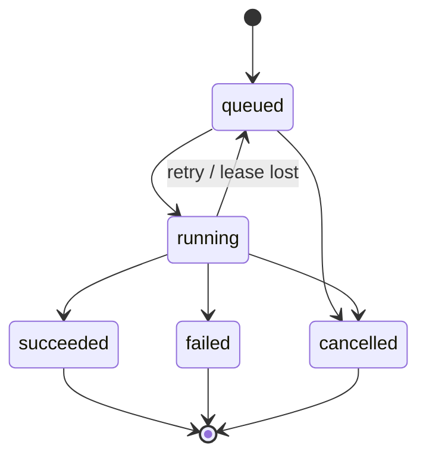

# Agent State

## What it is

How an agent run's lifecycle is stored and how concurrent workers change it
safely: status state machine, row locks, advisory locks, optimistic
concurrency, and one transaction spanning agent state and business data.
Tables: `agent_runs`, `workflow_state` in
[production-agent-schema.md](production-agent-schema.md).

## Why it matters

Workers crash, retry, and run in parallel. Without database-level guards
two workers advance the same run, a stale worker overwrites a newer
checkpoint, or a run is marked `succeeded` while its business write rolled
back. Every guard below is enforced by PostgreSQL, so it holds regardless
of which worker version is deployed.

## Run state machine



Two layers (both in the example DDL):

```sql
-- PostgreSQL SQL: valid VALUES (010_schema.sql). A CHECK cannot see the old row.
status text NOT NULL DEFAULT 'queued'
    CHECK (status IN ('queued','running','succeeded','failed','cancelled')),
CONSTRAINT agent_runs_finished_has_timestamp
    CHECK ((status IN ('succeeded','failed','cancelled')) = (finished_at IS NOT NULL))
```

```sql
-- PostgreSQL SQL: legal TRANSITIONS (050_state_machine.sql), via BEFORE UPDATE trigger
CREATE TRIGGER agent_runs_transition
    BEFORE UPDATE OF status ON agent_runs
    FOR EACH ROW EXECUTE FUNCTION enforce_run_transition();
```

Tested result: `UPDATE agent_runs SET status = 'running' ... WHERE status = 'succeeded'`
fails with `illegal agent_runs transition succeeded -> running`.

Tradeoff: a trigger adds a function call per status update and hides logic
from the application; the alternative is `UPDATE ... WHERE status = 'running'`
guards in every query, which are easy to forget. Use both: the guard in
the query gives a clean "0 rows" signal, the trigger is the backstop.

## Choosing a concurrency control

| Mechanism | Use when | Behavior | Cost / risk |
|---|---|---|---|
| Optimistic (`version` column) | Conflicts are rare; work between read and write is long (LLM call) | `UPDATE ... WHERE version = $n`; 0 rows = conflict, reload and retry | No lock held during the LLM call; needs retry logic; starvation under heavy contention |
| Row lock (`SELECT ... FOR UPDATE`) | Short read-modify-write inside one transaction | Others wait (or `NOWAIT` / `SKIP LOCKED`) | Lock held for the transaction; never hold across an LLM or HTTP call (blocks others, keeps a connection and transaction open) |
| `FOR UPDATE SKIP LOCKED` | Many workers draining a queue | Each worker takes a different unlocked row | Not a consistent view: skipped rows are invisible to that query; unsuitable for "read all rows consistently" |
| Advisory lock | Serialising work on something that is not a single row (a conversation, an external resource) | Application-defined keys; no row needed | Not tied to data; leaks if session-level locks outlive intent; incompatible with transaction-mode poolers when session-level |
| `SERIALIZABLE` | Complex multi-row invariants | Aborts conflicting transactions (`40001`) | Retries mandatory; see [04-transactions/isolation-levels.md](../04-transactions/isolation-levels.md) |

None is universally correct; the usual split is optimistic for run and
checkpoint state, `SKIP LOCKED` for the queue, row locks inside short
transactions.

## Optimistic concurrency

**PostgreSQL SQL.** `agent_runs.version` and `workflow_state.version`
start at 0; every writer bumps them.

```sql
-- Claim a queued run. 0 rows = someone else changed it first.
UPDATE agent_runs
   SET status = 'running', version = version + 1, attempt = attempt + 1,
       started_at = now(), updated_at = now()
 WHERE id = $1 AND version = $2 AND status = 'queued'
RETURNING version;
```

```sql
-- Save a checkpoint only if nobody else did since we read it.
UPDATE workflow_state
   SET step = $2, state = $3, version = version + 1, updated_at = now()
 WHERE run_id = $1 AND version = $4
RETURNING version;
```

Expected result: one row with the new version, or zero rows meaning
conflict. On zero rows reload, re-apply the change to fresh state, retry
(bounded). Tested with two sessions in
[optimistic_concurrency.py](../examples/production-agent-db/demo/optimistic_concurrency.py):
worker B's stale write was rejected and the retry produced
`{"fetched": true, "score": 0.9}` at version 2, with no lost update.

Common mistakes: forgetting `version = version + 1` on one code path
(silently disables protection for that path); reading the version in one
transaction and comparing in another without passing it through.

## Row locks and `SKIP LOCKED`

Details: [04-transactions/locking.md](../04-transactions/locking.md). Queue
claiming is in [workflow-state.md](workflow-state.md#claiming-tasks).

```sql
-- PostgreSQL SQL: fail fast instead of waiting behind another worker
SELECT id FROM agent_runs WHERE id = $1 FOR UPDATE NOWAIT;
-- ERROR:  could not obtain lock on row in relation "agent_runs"   (same error verified against `tasks`)
```

Set `lock_timeout` for workers so a stuck holder cannot stall the fleet
(`SET LOCAL lock_timeout = '2s';`). Keep transactions short: the example
role sets `idle_in_transaction_session_timeout = '60s'`.
See [15-production-runbooks/lock-contention.md](../15-production-runbooks/lock-contention.md).

## Advisory locks

Serialize per-conversation work (for example "one active run per
conversation") without a row to lock.

```sql
-- PostgreSQL SQL: transaction-scoped; released automatically at COMMIT/ROLLBACK
BEGIN;
SELECT pg_try_advisory_xact_lock(hashtextextended('conversation:' || $1, 0)) AS got;
-- got = false: another worker holds it, skip or retry later
COMMIT;
```

Tradeoffs versus row locks:

- Advisory locks are not visible to constraints and do nothing for rows you forget to guard; they only work if every code path takes them.
- Prefer `pg_*_advisory_xact_lock` (released at transaction end) over session-level locks: session-level locks survive until explicit unlock or disconnect, and misbehave behind transaction-pooling connection poolers where the session is not yours ([05-performance/connection-pooling.md](../05-performance/connection-pooling.md)).
- Hash collisions on `hashtextextended` are possible in a 64-bit key space; harmless for mutual exclusion (spurious waits), never use the lock as identity.
- A data-level alternative: partial unique index, e.g. `CREATE UNIQUE INDEX ... ON agent_runs (conversation_id) WHERE status = 'running'`, enforces one active run per conversation with no application cooperation, at the cost of an insert/update error to handle. (Not in the example DDL; add if the invariant applies to you.)

## Transactional consistency with business data

Agent state and business rows live in one database, so one transaction
covers both. [transactional_write.py](../examples/production-agent-db/demo/transactional_write.py)
closes a support ticket inside a single transaction that also: inserts the
idempotent `tool_calls` row, updates `support_tickets`, advances
`workflow_state`, and writes an `audit_logs` row.

Tested outcomes: a simulated crash after the business `UPDATE` rolled back
everything (ticket still `open`, zero `tool_calls` rows); the retry
committed once; a replay with the same idempotency key did nothing.

Rules:

- Do not hold the transaction open across the LLM call. Sequence: call the model (no transaction) -> validate -> open transaction -> write -> commit.
- External side effects (email, payment API) are outside the transaction. Use the idempotency key as the provider's idempotency key, or an outbox row written in the same transaction and delivered by a worker ([workflow-state.md](workflow-state.md)).
- Put ownership checks in the `WHERE` clause (`AND user_id = $n`), not in model-supplied arguments.

## Production usage

- Index and query "in-flight" runs via the partial index; alert on `running` rows with old `updated_at` (tested query):

```sql
SELECT id, status, updated_at FROM agent_runs
WHERE status = 'running' AND updated_at < now() - interval '15 minutes';
```

The 15 minutes is illustrative; derive it from your longest legitimate run.

- Bound retries: `attempt` counts claims; fail the run when it exceeds your limit.
- Record `agent_version` so a bad prompt release is identifiable.

## Security considerations

- Workers use `agent_app`; no DDL, no `TRUNCATE`.
- Cancel and status changes must be authorized by application checks plus ownership predicates; the model never supplies run ids or user ids that are trusted.

## Troubleshooting

| Symptom | Likely cause | Check |
|---|---|---|
| Updates "do nothing" (0 rows) | Stale `version` or status guard | Reload the row; compare version/status |
| Workers stall | Lock held across LLM call | `pg_stat_activity` for `idle in transaction`; [14-observability/pg-locks.md](../14-observability/pg-locks.md) |
| `illegal agent_runs transition` | Retry of a finished run | Treat as terminal; create a new run |
| Duplicate key on checkpoint insert | Two workers resumed one run | Add a claim step (queue or `WHERE status = 'queued'`) |

## Quick revision

- CHECK for values, trigger for transitions.
- Optimistic for long work, row lock for short work, `SKIP LOCKED` for queues.
- Prefer transaction-scoped advisory locks.
- Never hold a transaction across a model or HTTP call.
