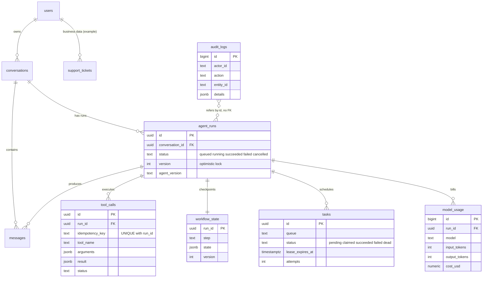

# Production Agent Schema

## What it is

A complete PostgreSQL 16 schema for agent systems, covering the ten
entities from [AGENTS.md](../AGENTS.md#12-agentic-ai-database-rules):
`users`, `conversations`, `messages`, `agent_runs`, `tool_calls`,
`workflow_state`, `tasks`, `audit_logs`, `model_usage`, `evaluation_runs`.

The DDL is not pasted here. Source of truth, executed and tested against
PostgreSQL 16:
[examples/production-agent-db/sql/](../examples/production-agent-db/sql/README.md).

| File | Run as | Contents |
|---|---|---|
| `000_roles.sql` | superuser | roles, database, connect privileges |
| `010_schema.sql` | `agent_owner` | all ten tables, constraints, indexes |
| `020_business_example.sql` | `agent_owner` | example business table (`support_tickets`) |
| `030_grants.sql` | `agent_owner` | least-privilege grants |
| `040_audit.sql` | `agent_owner` | audit immutability + status-change triggers |
| `050_state_machine.sql` | `agent_owner` | legal run-status transitions |

## ER diagram



## Design decisions

| Decision | Reason | Tradeoff |
|---|---|---|
| `uuid` PKs for runs, tool calls, tasks, conversations; `bigint identity` for high-volume append tables (`messages`, `audit_logs`, `model_usage`) | UUIDs are safe to generate in workers and expose in URLs; identity keys are compact and index-local for append-heavy tables | UUIDv4 inserts scatter across the index (more page splits, larger index); see [03-database-design/primary-keys.md](../03-database-design/primary-keys.md) |
| `status` as `text` + `CHECK (status IN (...))` | Adding a state is a cheap constraint change; readable in queries | Changing a CHECK needs `ALTER TABLE` (brief lock; add `NOT VALID` then `VALIDATE` on big tables). A native `ENUM` is stricter but harder to modify |
| Transition rules in a trigger, valid values in a CHECK | A CHECK cannot see the old row | Trigger logic runs on every status update; keep it small |
| `ON DELETE CASCADE` from run to its tool calls/state/tasks/usage | Children are meaningless without the run | Deleting a run is destructive; restrict `DELETE` privilege and prefer retention jobs |
| `ON DELETE RESTRICT` from conversations and tickets to `users` | Erasure of a user must be an explicit procedure, not a cascade accident | Erasure needs an admin-run script |
| `messages.run_id` is `ON DELETE SET NULL` | Transcript outlives run cleanup | Orphaned run reference is lost |
| No FKs on `audit_logs` | Audit rows must outlive the entities they describe | No referential integrity; entity id stored as text |
| `cost_usd` stored per call, not derived | Prices change; history must not | Wrong price at write time is baked in; add a correcting row, never edit |
| `agent_version` on runs and evals | Attribute behavior and regressions to a release | One more column to populate |

## Indexes (each tied to a query)

| Index | Query served | Cost |
|---|---|---|
| `conversations (user_id, updated_at DESC)` | A user's recent conversations | Maintained on every conversation touch |
| `messages UNIQUE (conversation_id, seq)` | Load a conversation in order; enforces ordering | Insert cost per message; the constraint is the point |
| `agent_runs (conversation_id, created_at DESC)` | Runs of a conversation | Write cost per run |
| `agent_runs (status, updated_at) WHERE status IN ('queued','running')` | Stuck/in-flight run detection | Partial: only active rows; updated when status enters/leaves |
| `tool_calls UNIQUE (run_id, idempotency_key)` | Idempotency guard; lookup by run | Required for correctness |
| `tasks (queue, priority DESC, available_at) WHERE status = 'pending'` | Claim query | Partial: stays small; extra write on each transition |
| `tasks (lease_expires_at) WHERE status = 'claimed'` | Lease reaper | Small partial index |
| `audit_logs (entity_type, entity_id, occurred_at)` | "History of this entity" | Highest write amplification on the busiest table; keep to what you query |
| `audit_logs USING brin (occurred_at)` | Time-range scans | Very small; useful only while insert order matches time order |
| `model_usage (created_at, model)` | Cost per day per model | Write cost on a ledger table |

Not indexed on purpose: JSONB columns (see [tool-calls.md](tool-calls.md#jsonb-when-and-when-not)),
`messages.content` (use full-text or vectors if you search it).
Validate with `EXPLAIN` on real data volumes ([05-performance/explain.md](../05-performance/explain.md)).

## Roles and privileges

| Role | Privileges | Used by |
|---|---|---|
| `agent_owner` | Owns schema; DDL | Migrations only |
| `agent_app` (member of `agent_rw`) | CRUD on mutable tables; `INSERT, SELECT` on `audit_logs` and `model_usage`; no DDL | Agent workers / API |
| `agent_ro` | `SELECT` on a short allow-list, read-only transactions, `statement_timeout = 5s` | Any tool that executes model-influenced reads |

General model: [06-security/least-privilege.md](../06-security/least-privilege.md).

## Apply

```bash
# Unix shell, PostgreSQL 16
psql "$ADMIN_DATABASE_URL" -v ON_ERROR_STOP=1 -f sql/000_roles.sql
for f in 010_schema 020_business_example 030_grants 040_audit 050_state_machine; do
  psql "$OWNER_DATABASE_URL" -v ON_ERROR_STOP=1 -f "sql/$f.sql"
done
```

Expected result: each file finishes without error. Production: run via
your migration tool as `agent_owner` ([09-alembic/production-migrations.md](../09-alembic/production-migrations.md)),
not by hand. `000_roles.sql` creates cluster-wide roles and a database:
adapt names for managed services where you cannot create databases or
roles directly.

## Common mistakes

- Putting `agent_app` in the owner role "for convenience": it inherits DDL and can drop the audit trigger.
- Storing the whole transcript in one JSONB column on `conversations`: every append rewrites the row.
- No `UNIQUE (conversation_id, seq)`: concurrent writers interleave and ordering is lost.
- Using `created_at` as message order: equal or skewed timestamps reorder history.

## Quick revision

- Ten entities, one schema, three roles.
- UUID for coordination objects, identity for append-only ledgers.
- CHECK = valid values; trigger = valid transitions.
- Every index names its query and its write cost.
