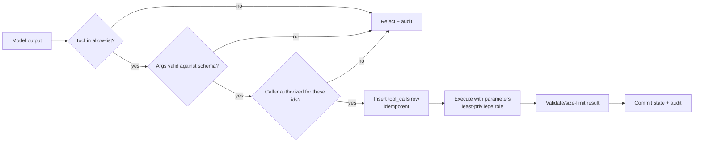

# Tool Calls

## What it is

Recording and executing the actions an agent requests (call an API, write a
row, send a message) so each one is validated, idempotent, auditable, and
replayable. Table: `tool_calls` in
[production-agent-schema.md](production-agent-schema.md).

## Why it matters

Agents retry: after a timeout, a crash, a lease expiry, or a model that
asks for the same action twice. Without a database-enforced guard, a retry
charges a card twice or sends two emails. And the arguments come from a
model whose output can be steered by any text it has read, so the
database layer must assume they are hostile.

## Idempotency keys

`UNIQUE (run_id, idempotency_key)` on `tool_calls` makes "one logical
call = one row". Claim the call by inserting; whoever inserts it executes
it.

```sql
-- PostgreSQL SQL, PostgreSQL 16. $n are bound parameters (never string-formatted).
INSERT INTO tool_calls (run_id, idempotency_key, tool_name, arguments, status, attempts)
VALUES ($1, $2, $3, $4, 'running', 1)
ON CONFLICT (run_id, idempotency_key) DO NOTHING
RETURNING id;
```

- One row returned: you own the call; execute it, then `UPDATE tool_calls SET status = 'succeeded', result = $r, completed_at = now() WHERE id = $id;`
- Zero rows: it already exists. `SELECT status, arguments, result FROM tool_calls WHERE run_id = $1 AND idempotency_key = $2;` and return the stored result (status `succeeded`), report in-flight (`running`), or decide on a retry (`failed`). Compare stored `arguments` with the new ones; a key reused with different arguments is a bug or an attack: reject it.

Tested with two `psql` sessions: session A inserted key `race1` inside an
open transaction; session B's identical `INSERT ... ON CONFLICT DO NOTHING`
blocked (about 1.5 s) until A committed, then returned `INSERT 0 0`. A
plain `INSERT` raised `duplicate key value violates unique constraint
"tool_calls_run_id_idempotency_key_key"`. In
[idempotent_tool_call.py](../examples/production-agent-db/demo/idempotent_tool_call.py)
two threads raced the same call: the side effect ran once, the loser got
`replayed = True`.

Why `DO NOTHING ... RETURNING` over `DO UPDATE`: `DO UPDATE` also returns
the existing row, but takes a row lock and writes a new row version on
every replay. Use `DO NOTHING` for the claim, then a `SELECT` for the
replay path.

### Choosing the key

| Strategy | Example | Property |
|---|---|---|
| Deterministic from workflow position | `step-3:close_ticket` | Stable across retries of the same step; two different calls in one step need distinct suffixes |
| Hash of `(run, step, tool, canonical args)` | `sha256(...)` | Dedupes identical requests; two intentional identical calls collapse into one |
| Provider tool-call id | model-returned id | Only unique per model response; a re-generated response gets new ids and defeats dedupe |

Never use a random value generated per attempt: it defeats the guard.

### Limits of the guard

- It protects the database row. An external side effect that succeeded before a crash and before the commit will run again on retry. Send the same idempotency key to the downstream API where it supports one, or write an outbox row in the same transaction and have a worker deliver it ([workflow-state.md](workflow-state.md)).
- A call stuck in `running` after a crash needs a policy: a reaper marks stale `running` rows `failed` (or re-queues the run) after a timeout. Choose the timeout from your tools' real latencies.

## JSONB: when and when not

`arguments` and `result` are JSONB because each tool has a different shape.

Constraints in the DDL:

```sql
arguments jsonb NOT NULL CHECK (jsonb_typeof(arguments) = 'object'),
result    jsonb,
CONSTRAINT tool_calls_result_only_when_succeeded CHECK (result IS NULL OR status = 'succeeded'),
tool_name text NOT NULL CHECK (tool_name ~ '^[a-z][a-z0-9_]{0,62}$')
```

Tested: `tool_name = 'Bad-Name'` and `arguments = '[1]'` are both rejected by
CHECK constraints. Add a size cap if payloads can be large:
`CHECK (pg_column_size(arguments) < 65536)` (tested as `ALTER TABLE ... ADD CONSTRAINT`; on a big table add it `NOT VALID`, then `VALIDATE CONSTRAINT`).

| Use JSONB for | Use real columns for |
|---|---|
| Per-tool argument/result payloads read mostly as a whole | Anything you filter, join, sort, or aggregate on routinely |
| Shapes that change often | Anything with a foreign key relationship |
| Provider responses you store for debugging | Anything needing `NOT NULL`, `UNIQUE`, `CHECK` per field |
| | Money, ids, timestamps (typed, smaller, planner has statistics) |

Cost of JSONB: no per-key constraints or foreign keys without extra work;
the planner has no column statistics for keys inside the document;
values over about 2 kB are TOASTed (compressed and stored out of line),
and an update rewrites the whole value.

### Indexing JSONB

If a JSONB key is queried often, first consider promoting it to a column.
Otherwise:

```sql
-- Containment queries: WHERE arguments @> '{"customer_id": 7}'
CREATE INDEX tool_calls_args_gin ON tool_calls USING gin (arguments jsonb_path_ops);

-- One hot key as an equality lookup: WHERE arguments->>'customer_id' = '7'
CREATE INDEX tool_calls_args_customer_idx ON tool_calls ((arguments->>'customer_id'));
```

Both validated on a scratch table (1,000 rows, results correct). Not in the
example DDL because no query in the example needs them; do not add them
"just in case". Tradeoffs:

| Index | Serves | Cost |
|---|---|---|
| GIN `jsonb_path_ops` | `@>` containment; smaller and faster than default `jsonb_ops` | Does not support key-existence operators (`?`); GIN inserts are slower and indexes are large; `fastupdate` pending list can add latency spikes |
| GIN `jsonb_ops` (default) | `@>`, `?`, `?|`, `?&` | Larger than `jsonb_path_ops` |
| Expression B-tree | One key, equality/range | Only that expression; query must use the identical expression |

`tool_calls` is write-heavy; every index slows each insert and update
(including the status update after execution). Measure with `EXPLAIN`
([05-performance/explain.md](../05-performance/explain.md)).

## Never trust LLM output

Everything the model emits (tool name, arguments, free text, generated
SQL) is untrusted input, exactly like a request body from the internet.
It may be wrong, malformed, or steered by prompt injection from any
document, web page, or tool result in its context.

Order of operations for every call:



BAD vs GOOD:

```python
# BAD: model text becomes SQL. Prompt injection => arbitrary statements.
conn.execute(f"UPDATE support_tickets SET status = 'closed' WHERE id = {args['ticket_id']}")
conn.execute(llm_generated_sql)  # under a role that can write
```

```python
# GOOD: allow-listed tool, strict schema, bound parameters, ownership in SQL.
class CloseTicketArgs(BaseModel):
    model_config = ConfigDict(extra="forbid", strict=True)
    ticket_id: int = Field(gt=0)
    resolution: str = Field(min_length=1, max_length=500)

args = CloseTicketArgs.model_validate(raw).model_dump()
conn.execute(
    "UPDATE support_tickets SET status = 'closed', resolution = %s "
    "WHERE id = %s AND user_id = %s AND status = 'open'",
    (args["resolution"], args["ticket_id"], current_user_id),   # from the session, not the model
)
```

Full runnable version, with a hostile payload (extra `status` field and a
`'; DROP TABLE` string in `resolution`):
[tools.py](../examples/production-agent-db/demo/tools.py),
[transactional_write.py](../examples/production-agent-db/demo/transactional_write.py).
Tested: the extra field was rejected by validation before any statement
ran; a string payload that passes validation is stored as inert text
because it is a bound parameter.

Validation is layered; each layer catches what the previous cannot:

| Layer | Catches |
|---|---|
| Allow-list of tool names, `extra="forbid"` schemas | Unknown tools/fields, wrong types, oversize values |
| Authorization from session context, not model args | Acting on another user's rows (put `AND user_id = $n` in SQL) |
| Database `CHECK`, `FK`, `NOT NULL`, `UNIQUE` | Anything that slipped past application code or a second code path |
| Least-privilege role | The blast radius when all of the above fail |
| Result validation / size caps | Oversized or poisoned tool results re-entering the context |

### Generated SQL (text-to-SQL tools)

Avoid it for writes. If a tool must run model-generated read queries:

- Run them as a dedicated read-only role (`agent_ro` in the example): `SELECT` on a short allow-list of tables or columns, nothing on `audit_logs`, `users`, or `tool_calls.arguments`.
- Treat `default_transaction_read_only` and `statement_timeout` on the role as defaults, not enforcement. Tested: `agent_ro` could `SET statement_timeout = 0` and `BEGIN READ WRITE`; the write still failed with `permission denied for table` because of grants. Grants are the boundary. Enforce hard limits additionally in the connection layer or a proxy.
- Parse and allow only a single `SELECT` statement; reject multiple statements, `COPY`, `SET`, and function calls outside an allow-list (functions such as `pg_sleep` or large `generate_series` are denial-of-service tools).
- Cap rows returned and result size before putting them back in the prompt.
- Row-level security is an option for multi-tenant data; it adds planning overhead and must be tested per policy.

General role design: [06-security/least-privilege.md](../06-security/least-privilege.md),
[06-security/permissions.md](../06-security/permissions.md).

## Prompt-injection implications for the DB layer

Prompt injection means content the model reads can instruct it. The
database cannot detect injected intent; it can only limit what a
compromised agent can do and leave evidence.

- The agent's database credentials define the worst case. Give workers `agent_app` (no DDL, no `DELETE`/`UPDATE` on audit, no access to other schemas). A separate role per tool family narrows it further, at the price of more connection pools and more roles to manage.
- Do not let the model choose the identity it acts as. `user_id`, `tenant_id`, and `run_id` come from authenticated session context.
- Stored text is a replay vector: a poisoned `messages.content` or `tool_calls.result` is re-fed to the model on later turns, and to other users if memory is shared. Store provenance (which tool/user produced it, `role`) and keep untrusted tool output marked as data when rebuilding prompts. Shared vector memory must be scoped by user/tenant ([conversation-memory.md](conversation-memory.md#vector-memory-with-pgvector)).
- Destructive or high-impact tools (refunds, deletes) benefit from a human-approval status (`pending_approval` can be added to the `status` CHECK) rather than direct execution; this trades latency for safety.
- Log rejected calls to `audit_logs`; a burst of rejections is an attack signal ([audit-logs.md](audit-logs.md)).
- Never place secrets in `tool_calls.arguments` or `result`; both are readable by anyone with `SELECT` and are replayed into prompts.

## Production usage

- Persist the call (`running`) before executing, update after. A crash leaves evidence of what was in flight.
- Store model-proposed arguments exactly as validated; do not mutate after validation.
- Redact PII before persistence if retention rules require it.
- Expire old results by retention policy; `result` can be large ([conversation-memory.md](conversation-memory.md#retention-and-partitioning)).

## Common mistakes

- Random idempotency keys per attempt.
- Executing the tool before inserting the row.
- Accepting `extra` fields and passing `**args` into SQL or ORM `update()`.
- Putting free-text model output into identifiers (table/column names) instead of mapping to an allow-list.
- Running tools under the migration or admin role.
- Indexing JSONB with GIN preemptively.

## Troubleshooting

| Symptom | Cause | Fix |
|---|---|---|
| Duplicate side effects | Key not stable across retries, or effect outside the guard | Deterministic keys; downstream idempotency; outbox |
| Call stuck `running` | Worker died mid-call | Reaper policy; retry or fail the call |
| `violates check constraint "tool_calls_..."` | Bad tool name / non-object args | Fix validation upstream; do not loosen the CHECK |
| Replay returns "different arguments" | Key collision or model changed args | Treat as error; investigate |

## Quick revision

- Insert first (`ON CONFLICT DO NOTHING RETURNING id`), execute only if you got the row.
- Deterministic idempotency keys; stable across retries.
- JSONB for variable payloads; columns for what you query; GIN only when a measured query needs it.
- Model output is untrusted: allow-list, strict schema, bound params, ownership in SQL.
- Grants, not session settings, are the security boundary.
