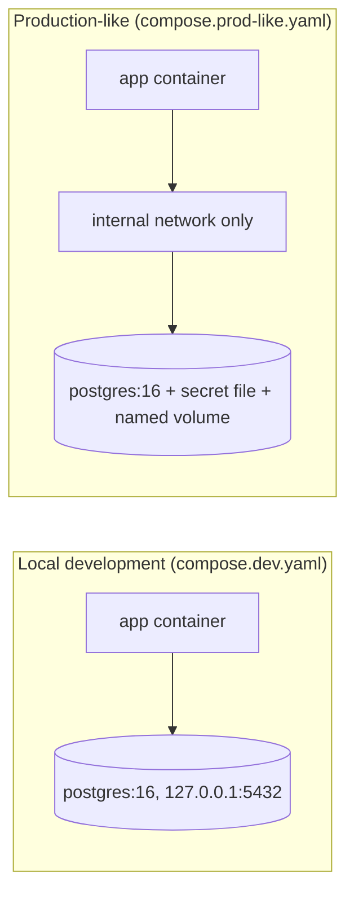

# Docker Overview

Running PostgreSQL and its application containers with Docker. Local
development is the primary use case; production use is a tradeoff covered
below.

## What it is

The official `postgres` image (Docker Official Image, Debian and Alpine
variants) plus patterns for Compose, Dockerfiles, configuration, and
persistent storage.

## Pages in this module

| Page | Covers |
|---|---|
| [docker-compose.md](docker-compose.md) | `docker compose` v2 files, health checks, `depends_on`, ports, `down` vs `down -v`, pgbouncer sidecar |
| [dockerfile.md](dockerfile.md) | Multi-stage Python image, non-root user, `.dockerignore`, extending the `postgres` image |
| [environment-variables.md](environment-variables.md) | `POSTGRES_*` variables, `_FILE` variants, `.env`, Docker secrets |
| [persistent-volumes.md](persistent-volumes.md) | Named volumes vs bind mounts, mount path (PG 17 and below vs 18+), permissions, backups |

Runnable files live in [examples/](examples/): `compose.dev.yaml`,
`compose.prod-like.yaml`, `.env.example`, `Dockerfile`, `.dockerignore`.

## Dev vs production

| Concern | Local development | Production-like / production |
|---|---|---|
| Compose file | `examples/compose.dev.yaml` | `examples/compose.prod-like.yaml` |
| Password | `.env` (git-ignored) | Secret file via `POSTGRES_PASSWORD_FILE`, or secrets manager |
| Published port | `127.0.0.1:5432:5432` | None; internal network, or loopback for admin access |
| Image tag | Pinned major (`postgres:16`) | Pinned exact minor or digest, tested before rollout |
| Data loss tolerance | `down -v` is routine | `down -v` deletes the database; never run it |
| Backups, HA, upgrades | Not needed | Required; Compose provides none of them |

## Production tradeoff: containerized vs managed PostgreSQL

| Containerized PostgreSQL (self-managed) | Managed service |
|---|---|
| Full control of version, extensions, config, `pg_hba.conf` | Provider handles patching, backups, failover; fewer knobs |
| You own backups, PITR, replication, failover, monitoring, upgrades | Provider features and limits vary; verify against current docs |
| Same environment in dev and prod | Dev/prod parity gap unless you mirror the engine version |
| Data durability depends on your volume and host storage | Storage durability is the provider's responsibility |

Neither is universally correct. A single-host Compose deployment fits
small, low-risk workloads where the team accepts the operational load.
See [13-cloud-production/README.md](../13-cloud-production/README.md).

## Common mistakes

- Using `postgres:latest`; a major version bump on pull breaks the data
  directory. Pin the tag.
- Expecting `POSTGRES_*` variables or `/docker-entrypoint-initdb.d` scripts
  to re-run on an existing volume. They run only when the data directory is
  empty.
- Publishing `5432:5432`, which binds every host interface.
- Treating `depends_on` without `condition: service_healthy` as readiness.
- Committing `.env` or putting passwords in a `Dockerfile` or compose file.

## Security considerations

- Keep secrets out of image layers and compose files; see
  [environment-variables.md](environment-variables.md) and
  [06-security/passwords-and-secrets.md](../06-security/passwords-and-secrets.md).
- The `POSTGRES_USER` role is a superuser. Create a separate application
  role (CRUD only) and migration role; see
  [06-security/least-privilege.md](../06-security/least-privilege.md).
- Do not set `POSTGRES_HOST_AUTH_METHOD=trust` outside a throwaway local
  container.

## Quick revision

- Pin `postgres:<major>`; mount a named volume at the correct path.
- Health check with `pg_isready`; gate dependents with `service_healthy`.
- Bind published ports to `127.0.0.1`.
- `docker compose down -v` deletes the database volume. Destructive.
- Compose is not a backup, HA, or upgrade strategy. Back up with
  `pg_dump`/PITR: [07-backups-recovery/](../07-backups-recovery/).
