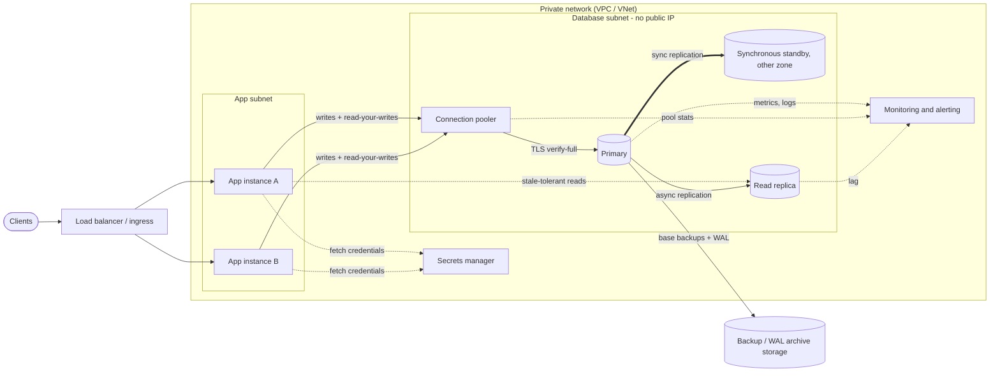
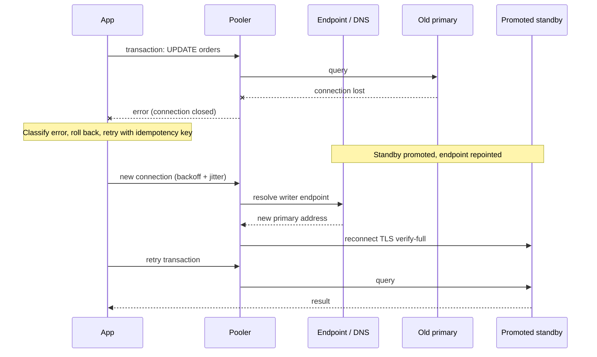

# Production Architecture

Vendor-neutral reference topology for PostgreSQL in the cloud, and the
distinct jobs of HA, read replicas, and backups. Versions: behavior
described is PostgreSQL 14+ streaming replication unless stated.

## What it is



Components and the page that covers each:

| Component | Purpose | Covered in |
|---|---|---|
| Private DB subnet | No internet route, no public IP | [networking.md](networking.md) |
| Pooler | Caps backend connections, absorbs reconnect storms | [scaling.md](scaling.md#connection-limits-and-pooling-at-scale) |
| Primary | Only writer | [managed-postgresql.md](managed-postgresql.md) |
| Standby (HA) | Failover target; not for reads in most managed offerings | [below](#ha-vs-read-replicas-vs-backups) |
| Read replica | Read scale-out, tolerates lag | [below](#replication-lag-and-read-your-writes) |
| Backup/WAL storage | Recovery from logical errors and disasters | [07-backups-recovery/](../07-backups-recovery/backup-strategy.md) |
| Secrets manager | Credential source of truth | [secrets.md](secrets.md) |
| Monitoring | Lag, connections, disk, failover events | [14-observability/monitoring.md](../14-observability/monitoring.md) |

## HA vs read replicas vs backups

Three different tools. Using one as a substitute for another is a
common production failure.

| | HA standby | Read replica | Backup + WAL archive |
|---|---|---|---|
| Protects against | Node/zone failure | Read load | Human error, corruption, deleted data, region loss |
| Replicates a bad `DROP TABLE` / `DELETE`? | Yes, immediately | Yes (after lag) | No: restore to a point before the error |
| Typical replication | Synchronous or quorum | Asynchronous | Periodic base backup plus continuous WAL |
| Serves reads? | Usually no (provider-dependent) | Yes | No |
| Failover | Automatic, same endpoint | Manual or scripted promotion | Restore into a new instance |
| Data-loss window on failure | Zero if synchronous | Up to replication lag | Up to last archived WAL |

Rules:

- HA gives availability, not recoverability. A destructive statement
  reaches the standby in milliseconds. Recovery from it needs
  [PITR](../07-backups-recovery/point-in-time-recovery.md).
- A read replica is a scaling tool. Promoting one for failover is a
  manual process with possible data loss; do not count it as HA unless
  the provider documents automated promotion semantics.
- Cross-region replicas or copied backups are the disaster-recovery
  layer; see [disaster-recovery.md](../07-backups-recovery/disaster-recovery.md).

## Synchronous vs asynchronous replication

| | Synchronous | Asynchronous |
|---|---|---|
| Commit returns after | Standby confirms (per `synchronous_commit` level) | Primary flushes its own WAL |
| Data loss on primary failure | None for acknowledged commits | Up to the unreplicated WAL |
| Write latency | Adds a network round trip to the standby | No added latency |
| Availability risk | A slow/unreachable standby can stall commits unless the platform handles it | Primary unaffected by replica health |
| Cross-region viability | Poor: round trip per commit | Normal |

Tradeoff, not a default: choose synchronous within a region (zones) when
zero acknowledged-data-loss matters more than commit latency; choose
asynchronous for cross-region and for read replicas. Managed services
decide the topology for you; read how yours behaves when the standby is
down.

In PostgreSQL, `synchronous_commit` can be relaxed per transaction
(`SET LOCAL synchronous_commit = off;`) for low-value writes such as
analytics events. That trades up to a short window of lost commits on
crash (no corruption) for latency. Do not apply it to payments or audit
rows.

## Replication lag and read-your-writes

Replicas apply WAL after the primary commits. A request that writes then
immediately reads from a replica can miss its own write.

Measure on the primary (PostgreSQL 10+):

```sql
SELECT application_name, state, sync_state,
       write_lag, flush_lag, replay_lag
FROM pg_stat_replication;
```

Measure on a replica:

```sql
SELECT now() - pg_last_xact_replay_timestamp() AS replay_delay;
```

`replay_delay` grows while the primary is idle (no new transactions to
replay), so alert on `pg_stat_replication` lag from the primary, or on a
heartbeat table, not only on this expression.

Patterns for read-your-writes:

1. Route a session's reads to the primary for N seconds after it writes.
2. Route anything on the write path of a user action (read-after-create,
   checkout, auth) to the primary; send dashboards, search, and reports
   to replicas.
3. Pass a commit LSN (`pg_current_wal_lsn()` after commit) and have the
   replica query wait until `pg_last_wal_replay_lsn()` passes it. This
   needs application code; most teams use 1 or 2.

Long queries on a replica can conflict with WAL replay and get
cancelled (`max_standby_streaming_delay`) or hold back vacuum on the
primary (`hot_standby_feedback`). Both are tradeoffs; see
[05-performance/vacuum.md](../05-performance/vacuum.md).

## Failover and what the application must handle



During failover every open connection and in-flight transaction is
lost. Application requirements:

| Requirement | Detail |
|---|---|
| Use the provider's stable writer endpoint (hostname) | Never an IP address. The address behind it changes on failover for providers that repoint DNS; see provider notes |
| Respect DNS TTL / re-resolve on reconnect | Long-lived resolver caches (JVM, some HTTP/DB clients) keep dialing the old primary. Verify your driver and pool re-resolve |
| Detect dead connections | Pool `pre_ping` / validation on checkout, TCP keepalives, `connect_timeout`. See [08-python-fastapi/connection-pooling.md](../08-python-fastapi/connection-pooling.md) |
| Retry with exponential backoff and jitter | Without jitter, all workers reconnect in the same instant |
| Retry only idempotent work | A commit may have succeeded before the connection dropped. Use idempotency keys or `INSERT ... ON CONFLICT DO NOTHING` so a retry does not double-apply |
| Distinguish error classes | Retry connection failures and serialization/deadlock errors (SQLSTATE `40001`, `40P01`) on a whole transaction; do not blindly retry constraint violations |
| Expect read-only errors | During or after a role change a stale connection may hit a node that is read-only (SQLSTATE `25006`). Treat as reconnect |
| Cap the retry window | Bound total retry time so a long outage surfaces as an error instead of piling up requests |
| Warm the plan/statistics state | After promotion, cumulative statistics views can reset; run `ANALYZE` if the provider advises it |

Rehearse: trigger the provider's failover on staging while load runs and
measure downtime **from the application**, not from the provider's event
log. Record it in the [deployment checklist](deployment-checklist.md).

## Production usage

- Spread app instances across the same zones as the database so a zone
  failure does not leave the app in the wrong zone with the primary.
- Put the pooler in the same network as the app or on the database host
  family; each extra hop adds latency and a failure mode.
- Keep replicas and the primary at the same PostgreSQL major version
  (physical replication requires it).
- Alert on replication lag, WAL/disk growth from inactive replication
  slots, and failover events; see
  [14-observability/monitoring.md](../14-observability/monitoring.md).

## Common mistakes

- Treating HA as a backup, then discovering a bad `UPDATE` replicated.
- Reading-after-write from a replica and "fixing" it with `sleep`.
- Hardcoding the primary's IP.
- Retrying non-idempotent writes after a dropped connection.
- Never testing a failover; the first one happens during an incident.
- Unmonitored replication slots retaining WAL until the disk fills; see
  [15-production-runbooks/disk-full.md](../15-production-runbooks/disk-full.md).

## AI/agentic use case

Agent workers that checkpoint `workflow_state` must survive a failover
mid-step: write the step result and the "step done" marker in one
transaction keyed by an idempotency key so a replayed step is a no-op.
See [11-agentic-ai/](../11-agentic-ai/README.md).

## Quick revision

- HA = availability; replicas = read scale; backups = recoverability.
- Sync replication: no acknowledged-data loss, adds commit latency.
  Async: fast, can lose the tail.
- Replica reads are stale by the lag; keep read-after-write on the primary.
- Failover drops all connections: stable hostname, reconnect with
  backoff and jitter, idempotent retries.
- Test failover under load and time it from the app.
