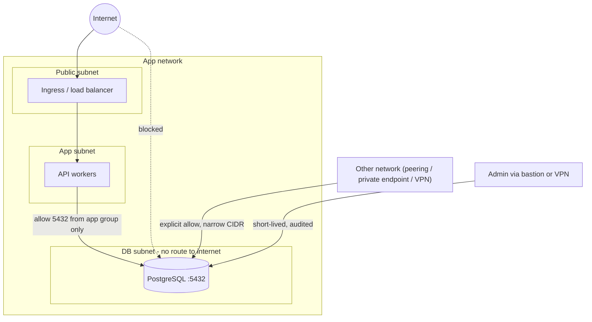

# Private Networking

How to keep PostgreSQL off the internet and reachable only from the
systems that need it. Vendor-neutral; provider mappings are in
[managed-postgresql.md](managed-postgresql.md#provider-notes). Server-side
settings (`listen_addresses`, `pg_hba.conf`) are in
[06-security/ssl.md](../06-security/ssl.md) and
[06-security/roles.md](../06-security/roles.md).

## What it is

Layered network controls so a stolen credential or a misconfigured rule
in one layer does not expose the database:



## Why it matters

A database with a public IP is scanned within minutes of exposure.
Authentication and TLS still apply, but brute force, credential stuffing,
and any PostgreSQL vulnerability become internet-reachable. A private
database turns those into insider or lateral-movement problems, which
the other controls (roles, TLS, audit) address.

## Rules

| Layer | Rule |
|---|---|
| Addressing | No public IP on the database. If the provider allows a public endpoint, disable it or restrict it to nothing |
| Routing | DB subnet has no route to an internet gateway. Outbound access (if needed for provider features) goes through a controlled path |
| Firewall / security group | Inbound TCP 5432 (or the pooler port) only from the app tier's security group or the narrowest CIDR you can name. No `0.0.0.0/0` and no whole-VPC `/8` "for now" |
| Egress | Restrict database egress unless the provider requires specific destinations (backup storage, identity service). Check the provider's required rules before locking down |
| Admin access | Through a bastion, VPN, or provider-brokered tunnel with individual identity and audit logging. Not by opening 5432 to an office IP indefinitely |
| Separate tiers | App, pooler, database, and admin tooling in separate groups so rules reference roles, not addresses |
| Pooler | Pooler accepts from the app tier; database accepts from the pooler (and migration runner) |
| Migration/CI | The migration role connects from the CI runner's private network or a dedicated job network, not from the internet |

Reference security-group rules (pseudo-config, not provider syntax):

```text
db-sg inbound:   tcp/5432  source=pooler-sg
                 tcp/5432  source=migration-runner-sg
db-sg outbound:  as required by provider (storage, identity)
pooler-sg inbound: tcp/6432 source=app-sg
app-sg inbound:  tcp/443 source=ingress-sg
```

Ports differ by pooler (PgBouncer commonly 6432); confirm the value your
service documents.

## Connecting networks

| Mechanism | Use when | Tradeoffs |
|---|---|---|
| Same network, separate subnets | App and DB in one VPC/VNet | Simplest; one blast radius |
| Network peering | Two networks need private connectivity | Usually non-transitive: A-B and B-C does not give A-C. Address ranges must not overlap. Cross-network DNS needs separate configuration |
| Private endpoint / private link style | Expose the database as a private address in a consumer network without joining networks | One-directional, narrower exposure; per-endpoint cost; DNS must resolve the database hostname to the endpoint address |
| VPN / dedicated link | On-premises or office to cloud | Latency and capacity limits; keep the allow-list narrow |
| Shared services (hub-and-spoke) | Many workloads, central inspection | More hops; an undersized inspection appliance becomes the bottleneck |

Do not assume the same constructs exist under the same names on every
provider; see the provider notes for mappings.

## DNS

- Always connect by hostname. Failover and maintenance can change the
  address behind it.
- Private DNS: the database hostname must resolve to the private address
  inside every network that connects, including peered networks and CI.
  "Works from the app VPC, fails from the migration job" is usually a
  missing DNS link, not a firewall rule.
- Verify from the client network: `nslookup db.internal.example` (Unix
  shell or Windows CMD) and `Test-NetConnection db.internal.example -Port 5432`
  (Windows PowerShell). The second only tests TCP reachability, not TLS or
  auth.
- With TLS `verify-full` the connection hostname must match a name in the
  server certificate. Pointing the client at a different private alias
  breaks verification; see [ssl-tls.md](ssl-tls.md).

## Verify from the database side

```sql
SELECT client_addr, usename, application_name, count(*)
FROM pg_stat_activity
WHERE backend_type = 'client backend'
GROUP BY 1, 2, 3
ORDER BY 4 DESC;
```

Every `client_addr` should be a pooler, app, or runner you recognize.
Unknown addresses mean a rule is too wide. Managed services may show the
provider's proxy addresses; document them. See
[14-observability/pg-stat-activity.md](../14-observability/pg-stat-activity.md).

## Common mistakes

- "Temporary" `0.0.0.0/0` on 5432 during a migration, never removed.
- Whole-VPC CIDR allow instead of the app security group.
- Public endpoint left enabled "for debugging" on a database that also has
  a private path.
- Peering without DNS: hostname resolves to a public address or fails.
- Forgetting that provider HA and backup components need specific internal
  traffic; locking down egress or adding deny rules breaks failover (see
  provider notes for documented examples).
- Using the database IP in connection strings; breaks after failover.

## Security considerations

Network controls complement, never replace: TLS `verify-full`,
SCRAM passwords or IAM tokens, least-privilege roles
([06-security/least-privilege.md](../06-security/least-privilege.md)),
and `pg_hba.conf` restricted to the app/pooler ranges. Log denied and
accepted connections at the network layer where the provider supports it.

## Troubleshooting

| Symptom | Check |
|---|---|
| `connection timed out` | Security group/firewall inbound rule, route table, subnet ACLs, wrong network |
| `connection refused` | Network path OK; wrong port, pooler down, server not listening |
| Hostname resolves to wrong/public address | Private DNS link missing for the client's network |
| Works from app, not from CI | CI runner network has no route, rule, or DNS |
| `no pg_hba.conf entry for host` | Network fine; server-side rule or TLS requirement; see [06-security/ssl.md](../06-security/ssl.md) |
| Works until failover, then fails | Hardcoded IP, DNS cache, or rule referencing the old node's address |

## Quick revision

- No public IP; DB subnet without an internet route.
- 5432 inbound from the app/pooler security group only.
- Hostnames, not IPs; private DNS resolvable from every client network.
- Peering is usually non-transitive and DNS-independent.
- Admin access via bastion/VPN with individual identity.
