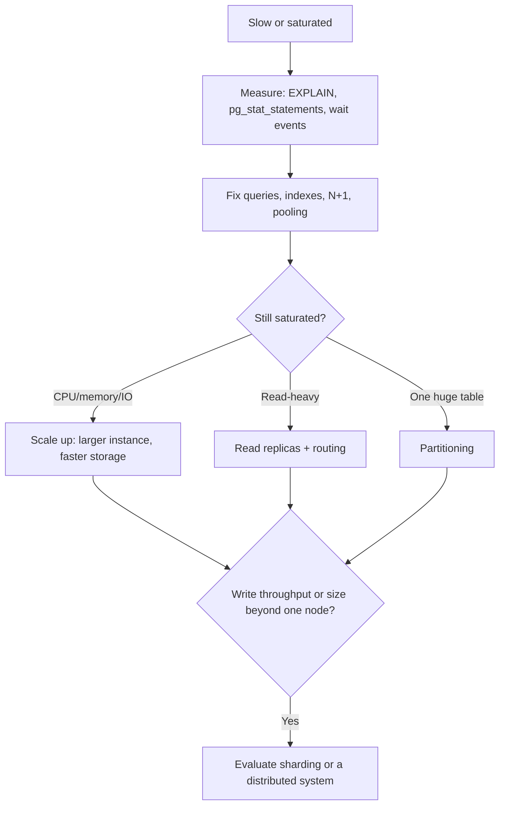

# Scaling PostgreSQL

Connection limits and pooling at scale, then the order in which to
scale: fix queries, scale vertically, add read replicas, partition,
and only then consider sharding. Pooling basics and PgBouncer modes are
in [05-performance/connection-pooling.md](../05-performance/connection-pooling.md);
application pool settings are in
[08-python-fastapi/connection-pooling.md](../08-python-fastapi/connection-pooling.md).

## Connection limits and pooling at scale

Each connection is a backend process. More connections than the server
can run in parallel add memory and scheduling overhead, not throughput.
Managed services set `max_connections` from the instance size or let you
override it within provider limits; read the value for your instance
rather than assuming one.

```sql
SHOW max_connections;
SHOW superuser_reserved_connections;
SELECT count(*) AS in_use FROM pg_stat_activity WHERE backend_type = 'client backend';
SELECT usename, state, count(*)
FROM pg_stat_activity
WHERE backend_type = 'client backend'
GROUP BY 1, 2
ORDER BY 3 DESC;
```

### Connection budget

Everything that can open connections shares one budget:

```text
max_connections
  - superuser_reserved_connections (+ provider/replication reserves)
  - monitoring and admin sessions
  - migration runner
  - pooler server pools (sum of pool_size across poolers and databases/users)
  = what is left for direct app connections
```

Worked, illustrative example (not a recommendation): with
`max_connections = 200`, 10 reserved for superuser/provider and
monitoring, 5 for a migration runner, and two pooler instances with a
server pool of 40 each (80), 105 connections remain as headroom for direct
clients and failover surges.

The danger is multiplication: `replicas x workers x pool_size`. 20
containers x 4 workers x pool of 10 is 800 potential connections
against a server that handles far fewer well. Autoscaling multiplies it
silently. Compute the worst case at maximum autoscaling.

### Where to pool

| Option | Fits | Tradeoffs |
|---|---|---|
| App-side pool only (SQLAlchemy, driver pool) | Few app processes, steady load | Each process holds its own pool; no cap across processes |
| External pooler (PgBouncer or similar) in transaction mode | Many processes, serverless/short-lived workers, spiky load | Breaks session state (prepared statements without support, `SET`, advisory locks, `LISTEN`); one more component and hop; can be a single point of failure |
| Provider-managed pooler/proxy | Same, with less operations | Provider limits and feature gaps (see provider notes); behavior during failover differs per provider |
| Raise `max_connections` | Rarely | Memory per connection; not a substitute for pooling |

Settings that keep a pooler healthy:

- Pool size sized to what the database can run concurrently (often a
  small multiple of CPU cores), not to the number of clients. Measure,
  do not copy a number.
- A queue timeout so overload fails fast instead of hanging requests.
- Transaction mode for stateless web traffic; session mode for workers
  that need session state ([05-performance/connection-pooling.md](../05-performance/connection-pooling.md)).
- Per-role limits as a backstop: `ALTER ROLE app_api CONNECTION LIMIT 100;`
  (limit applies to concurrent sessions of that role).
- `idle_in_transaction_session_timeout` and `statement_timeout` per role
  so a stuck client does not pin a connection; see
  [06-security/security-checklist.md](../06-security/security-checklist.md).
- App pool `pool_pre_ping`/validation and bounded `pool_recycle` so
  failover and idle timeouts do not leave dead connections.

Diagnose exhaustion with
[15-production-runbooks/connection-exhaustion.md](../15-production-runbooks/connection-exhaustion.md)
and [14-observability/pg-stat-activity.md](../14-observability/pg-stat-activity.md).

## Scaling order



### Vertical scaling (scale up)

| Pros | Cons |
|---|---|
| No application change | Ceiling set by the largest instance and storage the provider offers |
| Keeps one consistent transactional database | Resize usually restarts or fails over the instance; schedule it |
| Often the cheapest first step in engineer-hours | Cost grows faster than linear at the top end; you pay for headroom |
| Fixes memory-bound workloads (cache, sorts) directly | Does not fix lock contention or bad plans |

Do it after measuring which resource is saturated (CPU, memory and cache
hit rate, IOPS/throughput, connections). Provider IOPS and throughput
limits can bind before CPU; check them in the provider's documentation.

### Horizontal read scaling (replicas)

Adds read capacity only. Costs: replication lag (see
[architecture.md](architecture.md#replication-lag-and-read-your-writes)),
routing logic in the app, and a full instance per replica. Writes still
go to one primary.

### Partitioning

Declarative partitioning (PostgreSQL 10+; features improve in later
majors, so check the docs for your version) splits one logical table into
partitions by range, list, or hash.

| Benefit | Cost |
|---|---|
| Partition pruning scans only relevant partitions when the query filters on the partition key | Queries that do not filter on the key touch every partition |
| Dropping an old partition is a fast metadata operation instead of a huge `DELETE` plus vacuum | Primary keys and unique constraints must include the partition key |
| Smaller indexes and vacuum units per partition | More objects to manage; planning time grows with partition count; migrations touch each partition |
| Retention and archiving become cheap | Foreign keys referencing partitioned tables have restrictions that depend on the version |

Typical fit: time-series, logs, events, `model_usage`, `audit_logs`
([11-agentic-ai/](../11-agentic-ai/README.md)), where you filter by time
and drop old data. Partitioning is not an index substitute; justify it
with a query that filters on the key and verify pruning with `EXPLAIN`
([05-performance/explain.md](../05-performance/explain.md)). Detach or
drop partitions only after backup and confirming the target
(destructive: `DROP TABLE` on a partition deletes its data; prefer
`DETACH PARTITION` first and archive).

### When sharding is warranted

Sharding splits data across independent databases by a shard key. It adds
cross-shard queries, distributed transactions (or their absence),
resharding projects, and application complexity. Consider it only when
measured evidence shows all of these:

- A single primary at the provider's practical largest size cannot keep up
  with sustained write throughput or data volume, after query tuning,
  pooling, partitioning, and archiving.
- Data has a natural key with few cross-key transactions (tenant ID,
  customer ID).
- The team can operate many databases, migrations across all of them,
  and per-shard backups and failovers.

Alternatives to evaluate first: archiving cold data, moving analytics to
a separate system fed by replication, separating workloads into different
databases/services by domain, and managed distributed-PostgreSQL
offerings (verify each against provider docs; semantics differ). For
vector workloads at very large scale a dedicated vector store may be the
better fit; see [10-pgvector/indexing.md](../10-pgvector/indexing.md).

## Common mistakes

- Raising `max_connections` or the instance size to hide a connection leak.
- Autoscaling app replicas without recomputing the connection budget.
- Adding replicas to fix write contention.
- Routing read-after-write traffic to replicas.
- Partitioning a table whose queries never filter on the partition key.
- Planning sharding before measuring a single node's limits.

## Performance considerations

Verify scale decisions with measurements, not thresholds: connection
count over time, CPU and IO saturation, cache hit ratio, replication
lag, checkpoint and vacuum behavior, and per-query time from
`pg_stat_statements`. See [14-observability/](../14-observability/README.md).

## Quick revision

- Budget connections: `max_connections` minus reserves minus pool sizes;
  multiply by autoscaling.
- Pool in transaction mode for stateless traffic; mind session state.
- Order: fix queries, scale up, replicas for reads, partition big
  time-based tables, shard last.
- Replicas scale reads only and lag.
- Partition only when queries filter on the partition key.
