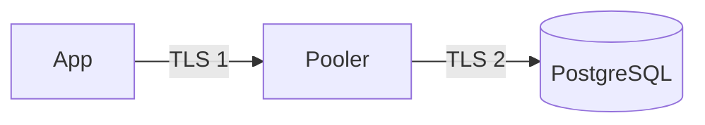

# TLS in the Cloud

Applying `sslmode=verify-full` against a provider's CA, handling
certificate rotation, and covering every hop (app, pooler, database).
Concepts, `sslmode` meanings, `pg_hba.conf` enforcement, and
`pg_stat_ssl` checks are in [06-security/ssl.md](../06-security/ssl.md);
this page does not repeat them.

## What it is

Managed services terminate TLS with a server certificate signed by the
provider's CA. The client must trust that CA and connect using a hostname
present in the certificate.

## Procedure

1. Get the CA bundle from the provider's documentation (links in
   [managed-postgresql.md](managed-postgresql.md#provider-notes)). Download
   over HTTPS from the provider's documented location; compare against any
   published checksum or the console copy.
2. Store the bundle in your image or configuration repository (it is
   public, not a secret) at a fixed path, for example `/etc/ssl/certs/db-ca-bundle.pem`.
3. Connect with `sslmode=verify-full` and `sslrootcert` pointing to it:

```bash
# Unix shell; psql (libpq)
psql "host=db.internal.example port=5432 dbname=appdb user=app_api sslmode=verify-full sslrootcert=/etc/ssl/certs/db-ca-bundle.pem"
```

4. Confirm encryption from the session:

```sql
SELECT ssl, version, cipher FROM pg_stat_ssl WHERE pid = pg_backend_pid();
```

5. Enforce on the server: provider flag or parameter that requires TLS
   (names are provider-specific, see provider notes) plus a rejection of
   plaintext. Verify with a client using `sslmode=disable`; it must fail.

Python: libpq-based drivers (`psycopg`) accept `sslmode` and
`sslrootcert` in the connection string. asyncpg takes an `ssl` argument
(an `ssl.SSLContext`) instead; build it from the bundle:

```python
import os
import ssl

import asyncpg


def build_ssl_context(ca_bundle_path: str) -> ssl.SSLContext:
    context = ssl.create_default_context(cafile=ca_bundle_path)
    context.check_hostname = True
    context.verify_mode = ssl.CERT_REQUIRED
    return context


async def open_connection() -> asyncpg.Connection:
    return await asyncpg.connect(
        host=os.environ["DB_HOST"],
        port=int(os.environ.get("DB_PORT", "5432")),
        database=os.environ["DB_NAME"],
        user=os.environ["DB_USER"],
        password=os.environ["DB_PASSWORD"],
        ssl=build_ssl_context(os.environ["DB_CA_BUNDLE"]),
    )
```

`create_default_context` verifies the chain and, with `check_hostname`,
the hostname, which corresponds to `verify-full`. This snippet was not
executed (no cloud database available); confirm the `ssl` argument
against the asyncpg and SQLAlchemy versions you pin. For SQLAlchemy 2.x
async engines, pass the context via `connect_args={"ssl": context}`; see
[08-python-fastapi/async-postgresql.md](../08-python-fastapi/async-postgresql.md).

## Rotation and trust-store hygiene

| Rule | Reason |
|---|---|
| Trust root CAs only. Do not add intermediate CAs or the server certificate to the trust store | Providers rotate intermediates and server certificates, sometimes unannounced. Pinning them breaks clients when that happens (provider docs say this explicitly; see notes) |
| Use the provider's bundle, not a single CA from it, unless the provider says otherwise | New CAs are added to bundles ahead of migration |
| Subscribe to provider certificate-rotation notices | Root CA changes are announced; the action is updating the bundle |
| Update the bundle in the image/config and redeploy before the cutover date | A server on a new CA with clients on an old bundle fails every connection at once |
| Test rotation in staging by connecting with the new bundle only | Catches missing roots early |
| Monitor certificate expiry on any certificate you manage (self-hosted, pooler) | Expired certificates break all `verify-*` clients |
| Keep `sslmode=verify-full` after rotation; never "fix" a failure by downgrading to `require` | `require` accepts any certificate |

Some providers restrict `verify-full` in private-DNS setups (hostname does
not match the certificate). If the provider documents `verify-ca` as the
fallback, treat that as a documented exception, record it, and compensate
with network isolation. See the Azure note in the provider notes.

## Every hop



- Terminate and re-originate TLS at a pooler or proxy only if you encrypt
  both hops, or document the trust boundary. A plaintext hop inside a
  private network is still plaintext.
- A managed proxy often presents its own certificate chain (different CA
  from the database). Check which bundle the client needs for the proxy
  endpoint; the AWS RDS Proxy note in the provider notes is an example.
- Self-managed PgBouncer: configure `client_tls_sslmode` (client side) and
  `server_tls_sslmode` plus `server_tls_ca_file` (to the database); use
  `verify-full` for the server side.
- Replication and migration tools need the same `sslmode` and CA, or they
  silently use `prefer`.

## Common mistakes

- Leaving `sslmode` unset (libpq default `prefer`) and assuming the
  managed service enforces TLS end to end.
- Copying a server certificate into the trust store instead of the root.
- Not shipping the new CA bundle before a provider CA rotation.
- Connecting through an IP address or alias not in the certificate, then
  disabling verification.
- Verifying only the app path; the migration job and BI tools use `prefer`.

## Security considerations

TLS protects data in transit and server identity; it does not
authenticate the client unless you use client certificates, which some
managed services do not support (see provider notes). Rotate database
passwords independently ([secrets.md](secrets.md)).

## Troubleshooting

| Symptom | Check |
|---|---|
| `certificate verify failed` | Bundle path, bundle contains the provider's current root, system clock, intermediate CA pinned by mistake |
| `server certificate ... does not match host name` | Connect with the hostname in the certificate; private DNS alias breaks `verify-full` |
| `SSL SYSCALL error: EOF detected` | Failover/restart, idle timeout in a middlebox, or pooler restart; reconnect logic |
| Works from laptop, fails in container | CA bundle missing from the image or wrong path |
| `no pg_hba.conf entry ... no encryption` | Server requires TLS; client `sslmode=disable` or driver not using TLS |

## Quick revision

- `verify-full` + provider CA bundle; trust roots only, never pins.
- Ship updated bundles before provider rotations; test with the new bundle.
- Encrypt every hop; confirm with `pg_stat_ssl`.
- asyncpg uses an `ssl.SSLContext`, not `sslmode`.
