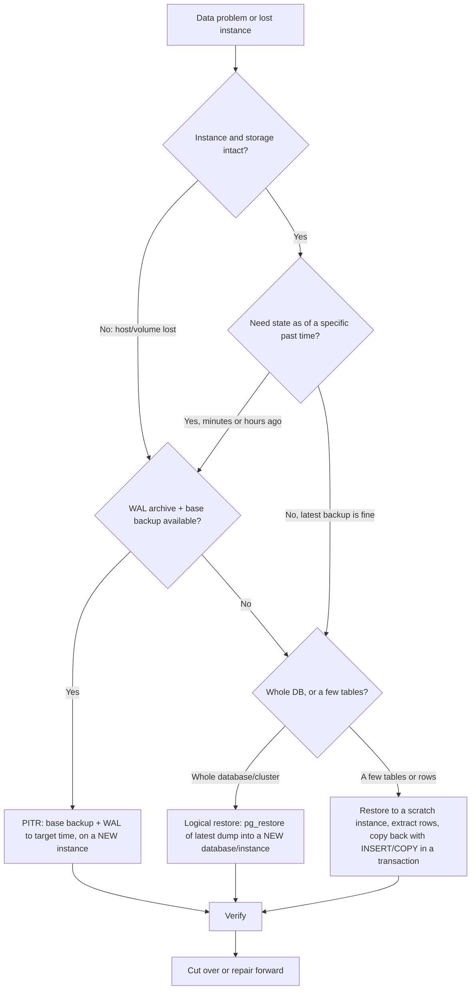

# Runbook: Restore a Database

Applies to PostgreSQL 16. Rule of this page: **restore to a NEW instance (or
a new database), verify it, then cut over.** Restoring over the live
database destroys the evidence and the only copy of the data you still have.

Detailed procedures: [07-backups-recovery/pg-restore.md](../07-backups-recovery/pg-restore.md),
[07-backups-recovery/point-in-time-recovery.md](../07-backups-recovery/point-in-time-recovery.md),
[07-backups-recovery/disaster-recovery.md](../07-backups-recovery/disaster-recovery.md).

## Symptoms (when you need this runbook)

- Data deleted or overwritten (bad `DELETE`/`UPDATE`/`DROP`, faulty deploy or migration, human error).
- Corruption (`invalid page in block`, checksum failures, index/heap mismatches).
- Host or volume lost; instance unrecoverable ([database-is-down.md](database-is-down.md), [disk-full.md](disk-full.md)).
- Need a copy of the data as of a past moment (audit, forensic, or to extract a few rows).

## Triage (first 2 minutes)

1. **Stop the damage:** pause writers (jobs, deploys, the offending service). If data is being wrongly modified, a read-only application mode beats a fast restore.
2. **Preserve what exists.** Do not drop, truncate, or "clean up" anything yet. Take a snapshot/copy of the current state (volume snapshot, or `pg_dump` of the affected tables) before anything else.
3. **Write down the target:** the exact time (UTC) just **before** the bad event, and what must be recovered (whole cluster, one database, a few tables, a few rows).
4. **Check what backups exist and how fresh** (managed console, backup bucket, `pg_basebackup` catalog), and whether WAL archiving covers the target time.

## Decision tree



| Option | Use when | Granularity | Data-loss window | Needs |
|---|---|---|---|---|
| **Logical** (`pg_dump` / `pg_restore`) | Latest dump is acceptable; moving or rebuilding; recovering specific tables | Database, schema, table | Everything since the dump | A dump file |
| **PITR** (base backup + archived WAL) | Bad change at a known time; need "just before"; instance lost | Whole cluster, to a chosen moment | Only after the target time | Physical base backup **and** continuous WAL archive (`archive_mode`, `archive_command`) |
| **Managed snapshot / point-in-time restore** (provider feature) | Managed service | Whole instance | Provider-defined | Provider backups enabled. Behavior is provider-specific: see [13-cloud-production/managed-postgresql.md](../13-cloud-production/managed-postgresql.md) |
| **Promote a replica** | Primary lost, replica is healthy and current | Whole cluster | Replication lag at failure | Healthy streaming replica. A replica also replicates bad deletes: it does **not** protect against logical mistakes |

A logical dump contains one database; it does **not** contain roles or
tablespaces. Capture them separately: `pg_dumpall --globals-only` (Unix shell).

## Diagnosis (what do I have?)

Unix shell:

```bash
pg_restore --list backup.dump | head -30      # does the archive read? lists tables, indexes, etc.
pg_restore --list backup.dump | grep -i "TABLE DATA"    # which tables have data in it
ls -lh /path/to/backups /path/to/wal_archive | tail     # freshness and WAL continuity
```

Is WAL archiving healthy right now (SQL, on the primary)?

```sql
SELECT archived_count, failed_count, last_archived_wal, last_archived_time, last_failed_time
FROM pg_stat_archiver;
```

An archive gap (missing segment between the base backup and the target time)
stops PITR at the gap. A dump file that lists correctly has a readable
table of contents; only a full restore proves the data is intact (so
verify below).

## Remediation (ordered, safest first)

### 0. Provision the target (never the live instance)

- A new instance (same major version or newer; **same major or newer** for logical restores, **same major** for physical/PITR), sized for the data, on separate storage. For logical restore a new empty database on the same server also works if space allows.
- Network-isolated from application traffic until verified (no app connects yet).

### Option 1: Logical restore of a dump (Unix shell)

Create an empty target database and load the dump. Tested on PostgreSQL 16:

```bash
createdb -h NEWHOST -U ADMIN_USER appdb_restore

pg_restore -h NEWHOST -U ADMIN_USER -d appdb_restore \
  --exit-on-error --single-transaction --no-owner \
  /path/to/appdb.dump
```

| Flag | Why |
|---|---|
| `--exit-on-error` | Stop at the first error instead of continuing silently (default is to continue) |
| `--single-transaction` | All-or-nothing: a failure leaves the database empty rather than half-loaded. Cannot be combined with `--jobs` |
| `--no-owner` | Avoid errors when the original owner role does not exist on the new server (grants to missing roles will still fail: restore roles first with the `--globals-only` file, or expect and review ACL errors) |
| `--jobs N` (alternative to `--single-transaction`) | Parallel restore for large dumps; a failure can leave partial data, so restore into a fresh database and discard on error |

Roles first, if the new server lacks them: apply the saved globals file with
`psql -f globals.sql` (it contains password hashes, so treat it as a secret).

After load, refresh planner statistics (a restored database starts without
good statistics):

```bash
vacuumdb -h NEWHOST -U ADMIN_USER --analyze-only -d appdb_restore
```

#### Restore **over** the live database (destructive, read first)

- **What it does:** `pg_restore --clean` / `--create`, or restoring into the existing populated database, drops and recreates objects with the dump's older contents. Without `--clean`, restoring into a populated database fails with `relation "events" already exists` (reproduced).
- **Why risky:** it overwrites the current data (including everything written after the dump), is not reversible without another backup, and a half-failed run leaves the live database in a mixed state.
- **Safer alternative:** restore into a new database/instance, verify, then cut over (below); or restore only the needed tables into a scratch database and copy rows back in a transaction.
- **Precaution:** first take a fresh backup/snapshot of the current state; confirm the target host and database name aloud (`\conninfo` in psql shows the connection you are on); stop all writers; get lead sign-off.

### Option 2: Point-in-time recovery (summary; full steps in the 07 page)

Physical restore of a base backup plus replay of archived WAL up to the target.
Run it on a **new** instance/data directory, never in the live one.

1. Restore the base backup into an empty data directory with the right ownership and mode `0700`.
2. Configure recovery in `postgresql.conf` (or `postgresql.auto.conf`) on the restored copy (all verified as parameters in PostgreSQL 16):

```ini
restore_command = 'cp /path/to/wal_archive/%f "%p"'      # your archive's fetch command
recovery_target_time = '2026-10-06 13:55:00+00'          # just BEFORE the bad event, with time zone
recovery_target_action = 'pause'                         # stop at the target so you can verify
```

3. Create the signal file `recovery.signal` in the data directory (PostgreSQL 12+; `touch "$PGDATA/recovery.signal"`) and start the server. It replays WAL, then pauses at the target.
4. Inspect the data (read-only). If the target is too late or too early, adjust `recovery_target_time` and repeat from the base backup. Recovery cannot be rewound past what it replayed.
5. When correct: `SELECT pg_wal_replay_resume();` (SQL) to finish recovery and promote, or `pg_ctl promote`.

Related targets: `recovery_target_xid`, `recovery_target_lsn`,
`recovery_target_name` (a restore point), `recovery_target_inclusive`,
`recovery_target_timeline`. Choose the target time as the last moment known
good. **Not run in this validation**: see [Not verified here](#not-verified-here).

### Option 3: Recover only some rows or tables

Restore (Option 1 or 2) to a scratch instance, then copy the rows back to
production inside a transaction, after review. Illustrative example (SQL on
production; assumes the scratch copy's tables are exposed as schema `restored`
through `postgres_fdw`, or loaded via `COPY` from a file):

```sql
BEGIN;
INSERT INTO orders (id, status)
SELECT id, status FROM restored.orders r
WHERE NOT EXISTS (SELECT 1 FROM orders o WHERE o.id = r.id);
-- check the row count, then:
COMMIT;      -- or ROLLBACK;
```

This keeps all newer data and repairs forward: usually safer than a whole
restore when only a few rows were lost.

### Verify before cutover (do not skip)

On the **restored** instance (SQL), compare against known-good expectations:

```sql
SELECT relname, n_live_tup FROM pg_stat_user_tables ORDER BY relname;   -- n_live_tup is an estimate
SELECT count(*) FROM orders;                                            -- exact counts of key tables
SELECT max(created_at) FROM orders;                                     -- newest row matches the target time (example column)
SELECT * FROM alembic_version;                                          -- expected schema revision
SELECT count(*) AS invalid_indexes FROM pg_index WHERE NOT indisvalid;  -- expect 0
```

- [ ] Row counts and newest timestamps match expectations (source count at backup time, or the last good report).
- [ ] Constraints and indexes present (`\d+ table` in psql: a psql client command).
- [ ] Application smoke test against the restored instance (read-only, or a staging app).
- [ ] Extensions present (`SELECT extname, extversion FROM pg_extension;`), e.g. `vector` for pgvector, and index rebuilds done if needed.
- [ ] `ANALYZE` done; a few key queries use expected plans.
- [ ] Sequences/identity values: after a logical restore they carry the dumped values; after PITR they match the target time. Check that new inserts will not collide (`SELECT last_value FROM sequence_name;` against `max(id)`).

### Cutover

1. Announce a short maintenance window; stop writers on the old instance (or set it read-only).
2. Take a final backup of the old instance and **keep it** (rename the old database/instance, do not drop it).
3. Cut over: change the application's `DATABASE_URL` / DNS / pooler target to the new instance (secrets manager, not shared in tickets), or `ALTER DATABASE appdb RENAME TO appdb_broken; ALTER DATABASE appdb_restore RENAME TO appdb;` within a single server (SQL; requires no sessions connected to either database; renames reproduced on the test server).
4. Restart or drain the application pools so they connect to the new target.
5. Keep the old data for the retention period of your incident process; drop it later, deliberately.

Renaming a database is blocked while sessions are connected; terminating them
is a destructive step ([connection-exhaustion.md](connection-exhaustion.md#pg_terminate_backend-destructive-read-first)).

## Verification (after cutover)

- [ ] Application error rate and latency normal; writes succeed.
- [ ] Replicas are rebuilt/reattached to the new primary; replication lag is normal (`SELECT * FROM pg_stat_replication;` on the primary).
- [ ] WAL archiving is running on the new instance (`pg_stat_archiver` `failed_count` stable) and a **new base backup** has been taken.
- [ ] Monitoring and alerts point at the new instance.
- [ ] Timeline recorded: data-loss window (what was lost between the restore point and the incident), and who was told.

## Prevention

- Test restores on a schedule and measure the time: an untested backup is a hope, not a backup. Record RTO and RPO as measured, not assumed.
- Continuous WAL archiving and base backups for PITR; monitor `pg_stat_archiver` and alert on failures.
- Keep backups off the primary's failure domain (different account/region/storage) and protect them from deletion.
- Separate permissions: the app role cannot `DROP`/`TRUNCATE`; destructive operations require the migration/admin role ([06-security/least-privilege.md](../06-security/least-privilege.md)).
- Pre-change snapshot or `pg_dump -t` of tables before destructive migrations ([failed-migration.md](failed-migration.md)).
- Strategy and schedules: [07-backups-recovery/backup-strategy.md](../07-backups-recovery/backup-strategy.md). Dump basics: [07-backups-recovery/pg-dump.md](../07-backups-recovery/pg-dump.md).

## Escalation / When to stop

- No usable backup, or the archive has a WAL gap before the target time: stop; engage the senior DBA and, for managed services, provider support (they may hold snapshots you cannot see).
- Restored data fails verification (counts, timestamps, `invalid page` errors): do not cut over; try the next-older backup on another new instance.
- Pressure to restore over the live database "to save time": say no; the lead decides in writing.
- `pg_resetwal` or editing `pg_control` is proposed as a restore substitute: see [database-is-down.md](database-is-down.md#escalation--when-to-stop). It risks a silently inconsistent database; restore from backup instead.
- Regulated or customer data involved: notify your security/compliance contact per your policy before sharing dumps or restoring to wider-access environments (dumps and backups contain full data and password hashes).

## Not verified here

Reproduced on a throwaway PostgreSQL 16 server: `pg_dump -Fc`,
`pg_restore --list`, `createdb` plus `pg_restore --exit-on-error
--single-transaction --no-owner`, `vacuumdb --analyze-only`, the failure when
restoring into a populated database, database rename, and the existence of the
`recovery_target_*`, `restore_command`, `recovery_target_action` parameters in
`pg_settings`. **Not run:** an actual PITR (base backup plus WAL replay,
`recovery.signal` flow, `pg_wal_replay_resume()`), `pg_dumpall --globals-only`
restore, parallel `--jobs` restore, and any managed-service restore.
